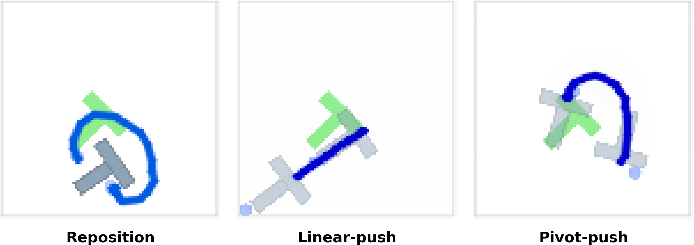
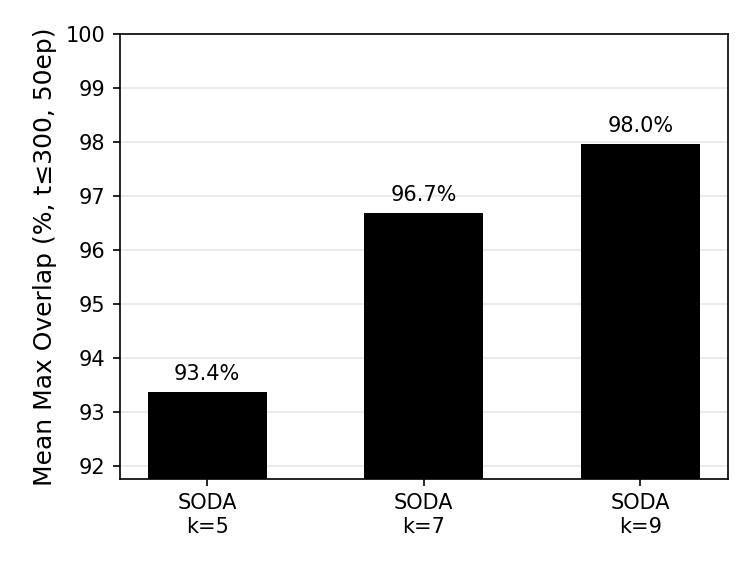
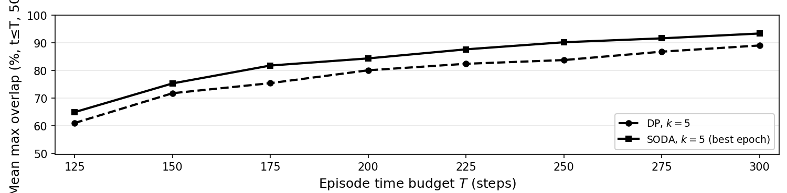

# SODA-policy

**SODA** — Supervised Option Discovery for Dynamic Action chunking.

Hierarchical imitation learning: a high-level policy selects **options**; a low-level **diffusion policy** outputs variable-horizon action chunks until a learned **termination** signal fires.

## Overview

Humans plan by intent — actions end when a sub-goal completes, not on a fixed timer. Action chunking policies (Diffusion Policy, ACT) have no such concept: they predict a fixed-length chunk of $T_p$ steps and execute $T_a \leq T_p$ before replanning. Two fundamental limitations arise:

- **Fixed prediction horizon $T_p$:** robot tasks decompose into semantic subtasks (reposition, push, align) with *variable* durations. A fixed $T_p$ under-plans long subtasks and over-plans short ones — misscoping the chunk degrades even the first $T_a$ steps executed.
- **Consistency–reactivity tradeoff (BID, 2024):** large $T_a$ gives smooth execution but cannot react to perturbations; small $T_a$ enables reactivity but causes jitter from constant replanning. No fixed value is optimal across all task phases.

**SODA** resolves both: π_high selects semantic *options* that scope $T_p$, and a learned termination signal β triggers replanning when needed — within the current option (perturbation) or by selecting a new option (sub-goal complete).

## Architecture

*Execution loop:*

1. π_high classifies the current observation into an option ω (a semantic sub-task).
2. π_low generates a variable-horizon action chunk conditioned on (s, ω) and executes Tₐ steps.
3. β evaluates the current state at each step. If it fires: replan within ω (perturbation), or query π_high for a new option (sub-goal complete).

*π_high (high-level policy):*

- ResNet-18 encoder + MLP classifier.
- Trained on **all** demonstration frames (not just segment starts) to predict the expert's current option — so it generalizes to mid-skill and recovery states encountered at inference.

*π_low (low-level policy):* extends the Columbia Diffusion Policy (1D U-Net + ResNet-18) with:

- **Option conditioning:** `Embed(ω, d=32)` concatenated to the global FiLM conditioning vector.
- **Duration channel:** D+1 action output; the extra channel predicts normalized segment length, used for temporal stretching at inference.
- **Termination head β:** MLP on bottleneck or encoded-observation features, trained with BCE.

**SODA-D**, the primary configuration evaluated below, infers option completion directly from the duration channel instead of the learned β head.

## Experimental Setup

Push-T: a circular end-effector pushes a T-shaped block into a goal zone. Observations are 2×96×96 RGB frames; actions are 2D end-effector displacements. ~206 demonstrations are labeled with 3 VLM-derived options.



*Figure 1 — the three options SODA's π_high learns to classify from Push-T demonstrations: **reposition** (agent approaches the block without contact), **linear-push** (agent drives the block in translation), **pivot-push** (agent rotates the block into the target orientation).*

## Results

Mean max block–target overlap (%), 50 episodes, Push-T, ≤300 steps:

| Method | Mean overlap (%) |
|---|---|
| DP baseline (k=5) | 89.0 |
| SODA-D (k=5) | 93.4 |
| SODA-D (k=9) | 98.0 |

**Headline findings:**

- **Hierarchy alone helps, not just receptive field.** At matched kernel size (k=5), SODA-D (93.4%) still beats flat DP (89.0%), a +4.3 pp gain attributable to option-conditioned planning rather than a wider U-Net kernel.
- **Noise robustness.** Under temporally-correlated action noise, DP degrades 17.2 pp (85.2% → 68.0%) while SODA-D degrades only 0.3 pp (87.2% → 86.9%).
- **Negative result.** Predicted-duration termination (SODA-D) outperforms every one of 8 learned termination-head (β) variants by ≥8 pp — the best learned variant reaches 89.7% vs. 98.0% for the duration channel. We report this as an honest finding rather than spin: on Push-T, a simple scalar readout is a more reliable completion signal than anything we learned.

<table>
<tr>
<td width="50%"></td>
<td width="50%"></td>
</tr>
<tr>
<td width="50%"><sub><b>Figure 2</b> — SODA-D mean overlap by kernel size (k∈{5,7,9}); performance increases monotonically with k.</sub></td>
<td width="50%"><sub><b>Figure 4</b> — SODA-D vs. DP (k=5) mean overlap across episode time budgets (T=125–300); SODA-D leads at every budget.</sub></td>
</tr>
</table>

**Failure modes.** Two distinct failure modes recur in the qualitative analysis. First, the learned β head can under-fire relative to π_low's own belief about completion: in a representative rollout, π_low predicts a residual duration of 1 step (its internal signal that the current option is done) while β outputs 0.48 — well below its 0.9 firing threshold — so π_high is never re-queried and the robot freezes in place for the rest of the episode. Second, SODA-D can reach out-of-distribution states with no recovery behavior in the training data: once the block is pushed into a corner of the workspace, a configuration the expert demonstrations never cover, the policy has no template for re-engaging it and stalls. Both are standard imitation-learning limitations rather than SODA-specific defects, and point toward DAgger-style corrective data collection as a natural next step.

**Report & poster:** [full report (PDF)](assets/SODA_report.pdf) · [poster (PDF)](assets/SODA_poster.pdf)
Umar Padela (Dept. of Aeronautics & Astronautics) and Neetish Sharma (Dept. of Computer Science), Stanford University.

## Documentation

| Doc | Contents |
|-----|----------|
| [`project_plan.md`](project_plan.md) | **Main reference** — architecture, full repo tree, data policy, configs, execution runbook (§7) |
| [`project_proposal.md`](project_proposal.md) | Project proposal |
| Per-folder `README.md` | Short notes under `data/`, `soda/`, `soda/option_discovery/`, `configs/`, `scripts/`, `modal/`, `experiments/` |

## Repo layout (quick)

| Path | What |
|------|------|
| [`data/`](data/README.md) | Zarr datasets on disk |
| [`soda/option_discovery/`](soda/option_discovery/README.md) | Offline labeling (Push-T heuristic, LOVE, Square TBD) |
| [`data/raw/pusht/pusht.zarr/`](data/raw/pusht/pusht.zarr/) | Push-T training data (committed) |
| [`soda/`](soda/README.md) | Training and inference code |
| [`configs/`](configs/README.md) | Experiment YAML (`soda_supervised`, `soda_unsupervised`, baselines) |
| [`scripts/`](scripts/README.md) | Train / eval helpers |
| [`experiments/`](experiments/README.md) | Checkpoints and logs (gitignored) |
| [`third_party/`](third_party/) | Git submodules: [Diffusion Policy](https://github.com/real-stanford/diffusion_policy), [LOVE](https://github.com/yidingjiang/love) |

For every file and module role, see [`project_plan.md` §3–§4](project_plan.md).

## Setup

### 1. Clone (includes submodules)

`third_party/` is wired as git submodules. Use **`--recurse-submodules`** so Diffusion Policy and LOVE are checked out at the commits pinned in this repo:

```bash
git clone --recurse-submodules <repo-url>
cd SODA-policy
```

If you already cloned without submodules:

```bash
git submodule update --init --recursive
```

You do **not** need to run `scripts/setup_submodules.sh` for a normal clone — that script is only for the initial one-time `git submodule add` on the maintainer side.

Verify:

```bash
git submodule status
ls third_party/diffusion_policy
ls data/raw/pusht/pusht.zarr
```

### 2. Data

Push-T labeled data is **already in the repo** at:

```text
data/raw/pusht/pusht.zarr/
```

No download or manual copy step is required for training on Push-T.

To **regenerate** Push-T supervised labels (optional): `python -m soda.option_discovery.supervised.pusht.build_zarr` — see [`soda/option_discovery/README.md`](soda/option_discovery/README.md).

### 3. Environment

**Training runs on [Modal](https://modal.com/)** (GPU containers), not on your laptop. See [`project_plan.md` §3 Compute](project_plan.md).

| File | Use |
|------|-----|
| [`environment.yml`](environment.yml) | **Local conda env** — Modal, W&B, labeling tools, PyTorch (CPU) for local dev |
| [`environment.modal.yml`](environment.modal.yml) | Pin reference for Modal GPU image only (full DP stack) |
| `modal/modal_config.py` | Remote image + Volume for checkpoints |

```bash
conda env create -f environment.yml
# if the env already exists: conda env update -f environment.yml --prune
conda activate soda
modal run modal/modal_smoke.py          # infrastructure smoke test
modal run modal/modal_download_dp.py    # one-time frozen DP ckpt on Volume
modal run modal/modal_eval.py --checkpoint /experiments/dp_baselines/pusht_image_cnn_train0/latest.ckpt
modal run modal/modal_train_low.py --config-name soda_supervised
modal run modal/modal_train_high.py --config-name soda_supervised \
  train_high.low_checkpoint=/experiments/train_low/pusht_soda_supervised/best.ckpt
```

See [`project_plan.md` §7 row 5](project_plan.md).

### 4. Development

Implementation status and next steps: [`project_plan.md` §7 Execution runbook](project_plan.md). Active training runbook: [`training_plan.md`](training_plan.md).

```bash
# Local (conda activate soda)
python soda/training/train_low.py  --config-path configs/pusht --config-name soda_supervised
python soda/training/train_high.py --config-path configs/pusht --config-name soda_supervised \
  train_high.low_checkpoint=experiments/train_low/soda_supervised/best.ckpt
```

Push-T E1 uses **3 skills** (option ids **0–2**). Regenerate labels after heuristic changes: [`soda/option_discovery/supervised/pusht/README.md`](soda/option_discovery/supervised/pusht/README.md).

## Submodule pins

Submodule commits are fixed in the parent repo (see `git submodule status`). To bump a dependency, check out a new SHA inside the submodule, then commit the updated gitlink from the repo root — see [`project_plan.md` §7 row 7](project_plan.md).
