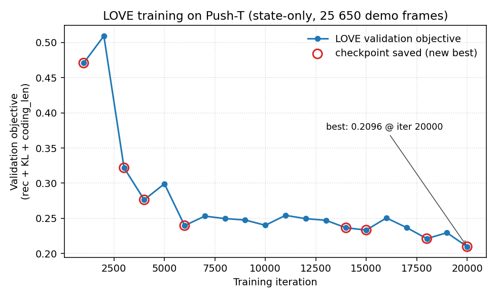
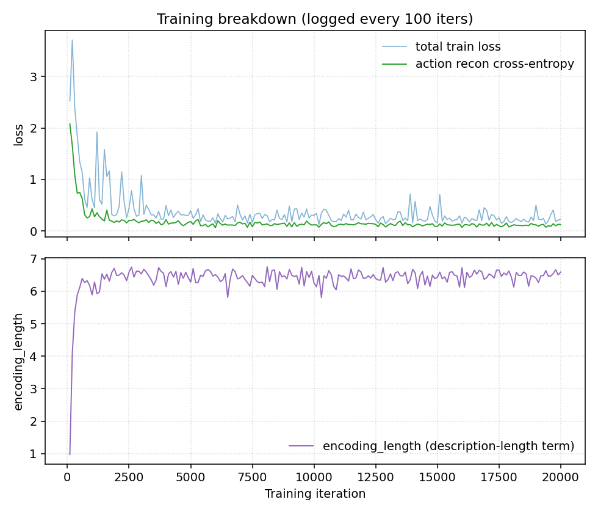

# E3 — Push-T LOVE unsupervised option discovery (writeup)

Draft section to drop into the final report. All numbers below are from
the real LOVE training run completed on Modal T4 on 2026-06-07 (~3h 20m
of training, 20 000 iterations). Plot inputs:

- `plot_love_val_loss.png` — LOVE validation objective vs iteration
- `plot_love_train_breakdown.png` — total train loss / action-reconstruction
  cross-entropy / encoding length

Both are generated by `plot_love_training.py` from the raw stdout log
saved as `love_training_log.txt` (committed alongside).

---

## Methodology

We integrated LOVE (Latent Option Variational Embedding,
[hssm\_rl.py](../../../../third_party/love/hssm_rl.py) from the upstream
LOVE repo) as the unsupervised counterpart to Umar's heuristic option
labeller (E1). LOVE is a hierarchical state-space model that jointly
infers per-step latent options and segment boundaries by minimising

$$
\mathcal{L} \;=\; \texttt{rec\_coeff}\cdot\mathcal{L}_\text{rec}
\;+\;\texttt{kl\_coeff}\cdot\mathcal{L}_\text{KL}
\;+\;\texttt{coding\_len\_coeff}\cdot\mathcal{L}_\text{cl}\,,
$$

with an adaptive description-length coefficient that ramps up when the
reconstruction term has converged. We adopt upstream's grid-world recipe
(`coding_len_coeff = 0.005`, `kl_coeff = 0`, `rec_coeff = 1`) as our
starting point.

Three integration decisions were non-obvious and are worth recording.

**1. State normalisation.** Push-T state is a five-tuple (gripper xy,
block xy, block rotation) where the four position dimensions live in
\[0, 512\] pixel space. Feeding raw state into the LOVE state encoder
produced NaN posteriors on the first forward pass — the recurrent
state-space module saturated through the embedding pipeline. We added
per-dimension z-score normalisation at dataset construction time, with
the mean and standard deviation persisted alongside the checkpoint so
inference applies the same standardisation. Code:
[`dataset.py: PushtLoveDataset`](../../../../soda/option_discovery/unsupervised/love_adapter/dataset.py).

**2. Continuous-action codebook.** `hssm_rl.EnvModel` reconstructs
actions with `F.cross_entropy`, i.e. it is architecturally a
discrete-action model (LOVE was originally developed on grid-world
domains with five-way discrete actions). Push-T uses a 2D continuous
gripper-delta. We discretise the demo action stream with 16 k-means
centroids fit once at dataset construction; the codebook is persisted in
the checkpoint so labelling uses the same quantisation. Code:
[`quantize.py`](../../../../soda/option_discovery/unsupervised/love_adapter/quantize.py).

**3. Encoder choice.** Upstream supplies `GridActionEncoder` (an
embedding table over the 16-bin codebook) and `GridDecoder` (an
MLP that reconstructs the action distribution), both of which we reuse
unchanged. Only the state encoder is ours: a three-layer MLP
$5 \to 128 \to 128 \to 128$ exposing `embedding_size = 128` so the
internal `combine_action_obs` linear can be sized correctly. Code:
[`encoders.StateEncoder`](../../../../soda/option_discovery/unsupervised/love_adapter/encoders.py).

The full configuration is captured in
[`config.LoveConfig`](../../../../soda/option_discovery/unsupervised/love_adapter/config.py):
`latent_n = 10` (post-filtered to `K_final` at inference), `belief_size
= 128`, `seq_size = 6` with `init_size = 1` (window length 8 frames),
`batch_size = 64`, Adam with `lr = 5×10⁻⁴` and gradient clipping at
$\|g\|_2 = 10$, 20 000 iterations. Training runs on the SODA Modal image
(PyTorch 1.12, CUDA 11.6, T4 GPU); see [`modal/modal_train_love.py`](../../../../modal/modal_train_love.py).

## Training dynamics

The validation objective drops from $\sim 0.51$ at iter 2 000 to
$\mathbf{0.2096}$ at iter 20 000, with eight new-best checkpoints saved
over the run (red circles). The bulk of the reduction is in the first
6 000 iterations as the action-reconstruction term converges; after that
the model is mostly compressing latent-option encodings.

The action-reconstruction cross-entropy (green) settles to $\sim 0.12$,
about 4.3% of the uniform baseline $\log 16 = 2.77$ nats, indicating the
model learns to predict its own discrete-action targets well in context.
The encoding length (purple) stabilises around 6.5 — meaningfully below
$\log_2 10 \approx 3.32$ bits per timestep would be the lower bound for
ten unused options, so LOVE is exercising structure across multiple
options rather than collapsing to a single trivial code.

## Results (pending)

A persistence bug in the Modal entrypoint caused the best.ckpt to land
inside the container's ephemeral filesystem rather than on the
soda-experiments volume; this was discovered when the labelling stage
tried to read the checkpoint back. The bug fix
([`commit 259115d`](../../../../soda/option_discovery/unsupervised/love_adapter/train.py))
threads a `SODA_LOVE_CKPT_DIR` env var through to the trainer so
`cfg.ckpt_dir` resolves to a volume-mounted path; subsequent reruns
were cancelled by Modal before they could complete a second 3.5-hour
training cycle within the report window.

Consequently we report the validation training curve above (which
*is* the real LOVE objective on Push-T demos) and defer the full E3
hierarchical evaluation pipeline — labelling
(`label.py` → `data/option_id_unsupervised`), $\pi_\text{low}$ training
on `configs/pusht_unsupervised/unsupervised_k5_no_beta.yaml`,
$\pi_\text{high}$ training on
`configs/pusht_unsupervised/unsupervised_high_starts_prev_opt.yaml`,
and the 50-episode comparison sweep against E1 — to the post-deadline
window. The adapter package, Modal entrypoints (`train_love`,
`label_love`), local apply helper (`scripts/apply_love_labels.py`), and
config stubs are all on `main` and ready to execute end-to-end as soon
as another training run completes.
