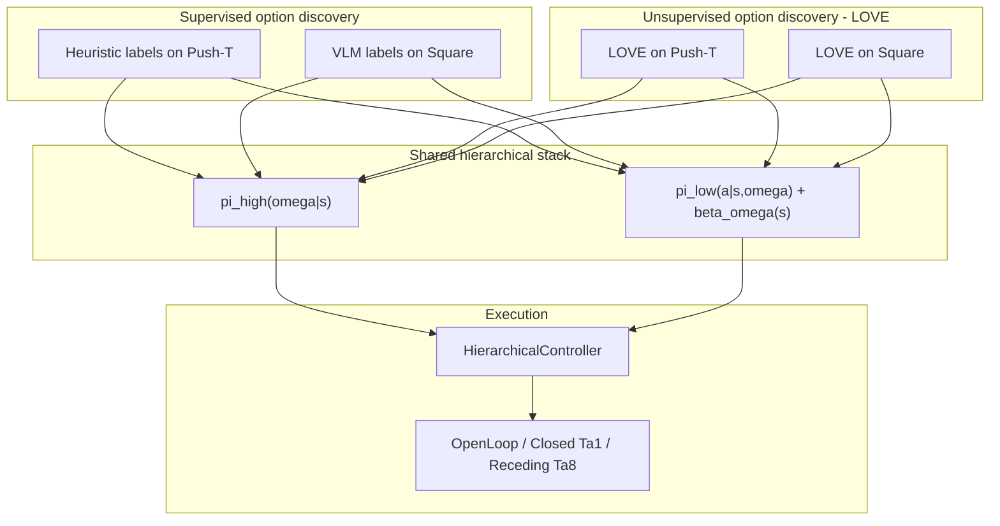
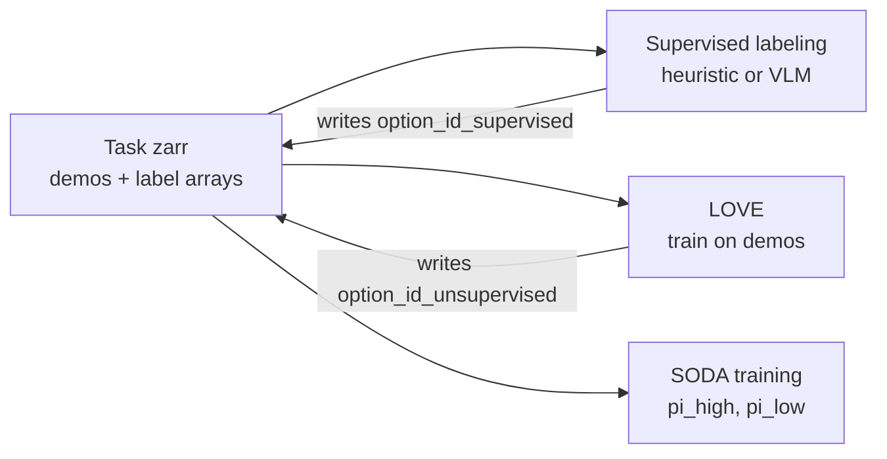

# SODA — Technical Project Plan

Living document for implementation. Derived from [`project_proposal.md`](project_proposal.md).

**Status:** Core stack **implemented** (§4.2 ☑); Phase 1 **training/eval not complete** (§7 rows 9–12, 23, 15–17, 26–27 ☐).  
**Branches:** `dev_umar` / `dev_neetish` → merge to `master` ([§11](#11-git-workflow))

---

## How to read this document

| Part | Sections | Use when you need… |
|------|----------|-------------------|
| **I — Overview** | [§1 Goal](#1-goal) · [§2 Architecture](#2-architecture) (incl. [networks / losses / HPs](#implementation-reference--networks-losses-data-hyperparameters)) | What SODA is; implementation details; experiments |
| **II — Repository & code** | [§3 Layout](#3-repository-layout) · [§4 Code map](#4-code-map) · [§5 Data](#5-data) | Where files go; zarr paths and artifacts |
| **III — Experiments & execution** | [§6 Evaluation](#6-evaluation) · [§7 Runbook](#7-execution-runbook) | Metrics, baselines, and **what to do next** |
| **IV — Project admin** | [§8 Open decisions](#8-open-design-decisions) · [§9–11](#9-team) · [Changelog](#changelog) | TBDs, ownership, git |

**Start implementing → [§7 Execution runbook](#7-execution-runbook)** — **Phase 1:** `soda_supervised` vs `dp_frozen` (rows 9–27); then Phase 2 (`soda_unsupervised`).

---

# Part I — Overview

## 1. Goal

Build a hierarchical imitation-learning policy where a high-level controller selects **options** and a low-level **diffusion policy** generates **variable-horizon** action chunks until a learned **termination** signal fires.

Option discovery is studied in a **2×2 matrix**: **supervised** vs **unsupervised (LOVE)** × **Push-T** vs **Square**—four training regimes sharing the same hierarchical stack. Labeling strategy per task is in [§2 Option discovery](#option-discovery); implementation steps are in [§7](#7-execution-runbook).

Compare against vanilla Diffusion Policy under a **matched eval protocol**. **P0 (locked):** **receding-horizon control** — predict a full action chunk, execute **`n_action_steps=8`**, replan (same for DP and SODA). **Later (optional):** open-loop (single plan per episode) or other execute windows. **Push-T** is scored by **max block–target overlap (%)** over a fixed step budget; **Square** uses the standard DP success metric.

---

## 2. Architecture

### System diagram



### Option discovery

How we obtain per-timestep option labels before SODA training. **One Zarr store per task** (e.g. `data/raw/pusht/pusht.zarr/`, `data/raw/square/square.zarr/`) holds demonstrations plus **multiple label arrays**—we do not duplicate `img` / `state` / `action` for supervised vs unsupervised runs.

| Zarr array | Source | Configs |
|------------|--------|---------|
| `data/option_id_supervised` | Heuristic (Push-T) or VLM (Square) | `soda_supervised.yaml` (`option_id_key`) |
| `data/option_id_unsupervised` | LOVE (fits on demos, writes labels into same zarr) | `soda_unsupervised.yaml` (`option_id_key`) |

Base layout matches [Diffusion Policy](https://github.com/real-stanford/diffusion_policy) Zarr v2 (`data/img`, `state`, `action`, `meta/episode_ends`). The hierarchical policies do not run VLM, heuristics, or LOVE at inference—those are **offline** only.



#### Supervised option discovery

Assign per-timestep skill ids using an external signal about which subgoal / skill is active. Export writes **`data/option_id_supervised`** into the task zarr.

| Task | Method | Notes |
|------|--------|--------|
| **Push-T** | **Heuristics** | Rule-based labels from state/contact (e.g. overlap, motion phases). VLM was tried first but did **not work well** on Push-T—phases are contact-heavy and hard to segment reliably from vision alone. |
| **Square** | **VLM** | Vision-language model labels subgoals from images (standard approach for semantic phases on visual demos). |

**Scripts and artifacts** (see [`soda/option_discovery/README.md`](soda/option_discovery/README.md))

| Task | Path | Output |
|------|------|--------|
| **Push-T** | [`build_zarr.py`](soda/option_discovery/supervised/pusht/build_zarr.py), [`visualize_labels.py`](soda/option_discovery/supervised/pusht/visualize_labels.py), [`heuristics.py`](soda/option_discovery/supervised/pusht/heuristics.py) | `option_id_supervised` in [`data/raw/pusht/pusht.zarr/`](data/raw/pusht/pusht.zarr/) |
| **Square** | [`supervised/square/`](soda/option_discovery/supervised/square/) (placeholder) | Future VLM → `data/raw/square/square.zarr/` |

Push-T: optional [Colab](https://colab.research.google.com/github/umar-padela/SODA-policy/blob/dev_umar/data/pusht/pushT_labeling.ipynb) for visualization / threshold checks only (not in repo).

Configs: `configs/{pusht,square}/soda_supervised.yaml` → same zarr path, `option_id_key: option_id_supervised` ([§4.3](#43-configs-and-scripts)).

#### Unsupervised option discovery (LOVE)

[LOVE](https://github.com/yidingjiang/love) discovers a discrete option set and skill boundaries **without** human or VLM labels—typically by optimizing a compression / description-length objective over demonstration sequences so that skill assignments are statistically meaningful rather than hand-defined.

- **Input:** reads demonstration arrays (`img`, `state`, `action`) from the task zarr; does **not** use `option_id_supervised`.
- **Training:** LOVE fits its discovery objective on those trajectories (offline, before SODA).
- **Output:** per-timestep cluster / skill id written into **`data/option_id_unsupervised`** in the **same** zarr (no second dataset copy).
- **Code:** `soda/option_discovery/unsupervised/love_adapter/` (wraps / adapts [`third_party/love`](third_party/love)).
- **Caveat:** LOVE was developed in simpler observation settings; image-based Push-T / Square may need an **encoder adapter** and tuning (skill count, minimum segment length, filtering degenerate skills). Remaining open choices: [§8F](#f-love-integration-open).

Configs: `configs/{pusht,square}/soda_unsupervised.yaml` → same zarr path, `option_id_key: option_id_unsupervised`. Experiments **E3** (Push-T) and **E4** (Square).

**Implementation steps (all methods):** [§7 Execution runbook](#7-execution-runbook) only—not duplicated here.

### Experiments (2×2 + P0)

Same stack (`pi_high` + `pi_low` + termination); only **how options are labeled** changes.

| | **Push-T** | **Square** |
|--|------------|------------|
| **Supervised** | Heuristic (`supervised/pusht/build_zarr`) | VLM (`supervised/square/`, TBD) |
| **Unsupervised (LOVE)** | LOVE → `option_id_unsupervised` | LOVE → `option_id_unsupervised` |

**Comparisons we care about:** supervision type (supervised vs LOVE); task (Push-T vs Square); vs frozen vanilla DP under the **same receding-horizon eval protocol** (P0).

| ID | Discovery | Task | Owner | Status | Runbook |
|----|-----------|------|-------|--------|---------|
| **M1** | π_high option-id accuracy (E1 first; E1 vs LOVE after Phase 2) | Push-T | Umar | Not started | §7 rows 15, 17; then §7.G |
| **P0** | Push-T eval gate: `soda_supervised` vs frozen DP (receding-horizon h=8) | Push-T | Umar | Not started | §7 rows 26–27 |
| **E1** | Heuristic supervised | Push-T | Umar | Zarr **complete** | §7 C (π_low) → E (π_high) → F |
| **E2** | VLM supervised | Square | See §7 | Not started | §7 rows 30–32 |
| **E3** | LOVE unsupervised | Push-T | See §7 | Not started | §7.G (**after P0 supervised**) |
| **E4** | LOVE unsupervised | Square | See §7 | Not started | §7 rows 33–34 |

### Component design (locked)

#### Execution loop

1. `pi_high` selects option `ω` given state `s` (segment start or after β fires).
2. `pi_low` diffuses action chunks conditioned on `(s, ω)` until `beta_omega(s) > beta_transition` or `n_action_steps` exhausted.
3. Repeat.

**P0 eval (locked):** receding-horizon — `n_action_steps=8` (execute 8 actions per diffusion plan before replan). Training predicts full chunks; execute window is **eval-only**. See [§6](#6-evaluation).

#### Training order (Push-T Phase 1, locked)

1. **Train π_low** from scratch (`train_low.finetune_dp_checkpoint: null`).
2. **Train π_high** with frozen vision from π_low (`train_high.low_checkpoint` → π_low `best.ckpt`).
3. **Hierarchical eval** vs frozen Columbia DP under matched protocol.

Columbia DP is **eval baseline only** for P0, not π_low initialization.

---

### Implementation reference — networks, losses, data, hyperparameters

Authoritative yaml: [`configs/pusht/soda_supervised.yaml`](configs/pusht/soda_supervised.yaml) (E1). Square / unsupervised configs mirror the same blocks with different `option_id_key`.

#### π_low (`LowPolicy`) — architecture

| Piece | Implementation | Push-T defaults (`soda_supervised.yaml`) |
|-------|----------------|------------------------------------------|
| **Backbone** | Subclass `DiffusionUnetHybridImagePolicy` (Columbia 1D conditional U-Net + hybrid vision) | `down_dims: [512, 1024, 2048]`, `kernel_size: 5`, `n_groups: 8`, `cond_predict_scale: true` |
| **Vision** | ResNet-18 hybrid encoder (GroupNorm, spatial softmax pooling); random crop train / fixed crop eval | `crop_shape: [84, 84]`, `obs_encoder_group_norm: true`, `eval_fixed_crop: true` |
| **Obs conditioning** | `obs_as_global_cond: true` — encode `n_obs_steps` frames → flatten → **FiLM** global cond | `n_obs_steps: 2` |
| **Option conditioning** | `nn.Embedding(num_options, option_embed_dim)` → **concat** to global cond (U-Net widened via patch) | `option_embed_dim: 32` |
| **Action head** | Predict **D+1** per timestep: D env dims + **duration channel** (normalized remaining segment length) | Push-T D=2 → action dim 3 |
| **Horizon** | U-Net sequence length; variable native suffix stretched to fixed `horizon` | `horizon: null` → auto = longest option segment in zarr (~84 on current Push-T labels) |
| **Diffusion** | DDPM, ε-prediction | `num_train_timesteps: 100`, `num_inference_steps: 100`, `squaredcos_cap_v2`, `prediction_type: epsilon` |
| **Termination β** | `TerminationHead`: MLP on **mean-pooled U-Net bottleneck**, `stop_grad(bottleneck)` | `hidden_dim: 256`, `num_layers: 2`, `bottleneck_dim: 2048` |
| **Code** | `soda/models/low_policy.py`, `termination_head.py`, `unet_bottleneck.py` | |

**Inference:** `predict_action(obs, ω)` → DDPM sample full horizon chunk; execute rows `[n_obs_steps-1 : n_obs_steps-1+n_action_steps)` (DP convention). Duration decode: mean-pool last channel × `horizon` → `TemporalStretcher.unstretch`.

#### π_low — training data (`OptionAwareDataset`)

| Topic | Behavior |
|-------|----------|
| **Index unit** | One PyTorch sample per **contiguous option segment** (not Columbia sliding windows) |
| **Train anchor** | `random_anchor=True` — uniform frame in `[seg.start, seg.end)` |
| **Val anchor** | Same as train (`random_anchor` inherited) — comparable loss distribution; val loader is unshuffled so anchors are reproducible each epoch |
| **Obs** | `n_obs_steps` frames ending at `anchor` (padded at segment start) |
| **Action target (locked)** | **Suffix** `action[anchor : seg.end]` → linear stretch to `horizon` + duration channel (aligned with mid-skill replanning) |
| **β label** | `derive_beta_labels`: **1** on last frame of each segment, else **0** (not stored in zarr) |
| **Scale (Push-T)** | ~206 episodes → ~1,430 segments; ~90% train @ `val_ratio: 0.1` → **~20 optimizer steps/epoch** @ `batch_size: 64` (much smaller than Columbia’s sliding-window loader) |

Factory: `build_option_dataset_from_config(cfg)` · tests: `tests/test_option_aware_dataset.py`.

#### π_low — loss functions

Combined loss (only `loss_total` is backpropped):

\[
L_{\text{total}} = L_{\text{diffusion}} + \lambda \, L_{\text{termination}}
\]

| Term | Formula | Gradients into |
|------|---------|----------------|
| **`L_diffusion`** | Masked MSE between U-Net ε-prediction and sampled noise target (Columbia DP pattern) | U-Net, vision encoder, `option_embed` |
| **`L_termination`** | `BCEWithLogits(β_logit, beta_label)` with optional **`pos_weight`** on β=1 class | **TerminationHead only** (bottleneck detached). **Separate U-Net forward at `t=0`** on clean expert suffix (matches `predict_beta`; diffusion still uses random `t`). |
| **λ** | `low_policy.termination_loss_weight` | Scales termination head LR effective step only |

**Class imbalance helpers (train only):**

| Knob | Config | Effect |
|------|--------|--------|
| **`termination_pos_weight`** | `low_policy.termination_pos_weight` — `null` → auto **γ = (# β=0 frames) / (# β=1 frames)** on train episodes | Upweights rare terminate labels in BCE |
| **`option_balance`** | `train_low.option_balance: inverse_freq` | Per-option segment inverse-frequency weights on **both** diffusion and termination per-sample losses |

Code: `soda/training/losses_low.py`, `soda/training/option_balance.py`.

**Checkpoint selection:** lowest **`val_loss`** (combined). Logged: `loss`, `loss_diffusion`, `loss_termination`.

#### π_high (`HighPolicy`) — architecture

| Piece | Implementation | Push-T defaults |
|-------|----------------|-----------------|
| **Vision** | `ObsEncoder` — frozen hybrid DP ResNet + normalizer; flatten `n_obs_steps` encoded frames | **`from_low_policy_checkpoint`** (preferred) or `from_dp_checkpoint` fallback |
| **Option representation** | Learnable `nn.Embedding(K, option_embed_dim)` — flow target **x₁** | `option_embed_dim: 32`, `num_options: null` → infer from zarr (E1: **3** skills) |
| **Flow field** | `OptionVelocityMLP`: concat `[x_t, global_feat, time_embed(t)]` → MLP → `v_pred` | `fm_hidden_dim: 256`, `fm_num_layers: 3`, `time_embed_dim: 32` |
| **Schedule** | `OptionFlowMatchingSchedule` — linear OT path: `x_t = t·x₁ + (1-t)·x₀`, target velocity `v* = x₁ - x₀` | Same convention as assignment1 HW1 |
| **Inference decode** | Euler integrate noise → endpoint embedding → **nearest row** in embedding table (L2) | `num_inference_steps: 10` |
| **Code** | `soda/models/high_policy.py` | |

#### π_high — training data (`OptionStartDataset`)

One sample per option segment at **`segment.start`** (not random anchor): `(obs at skill start, option_id)`.

#### π_high — loss

\[
L_{\text{FM}} = \mathbb{E}_{t \sim U(0,1)} \big[ \| v_\theta(x_t, s, t) - (x_1 - x_0) \|^2 \big]
\]

Per-sample MSE on option embedding velocity; optional **`option_balance: inverse_freq`** (same helper as π_low).

**Checkpoint selection:** highest **`val_option_acc`** (nearest-embedding decode vs ground-truth ω on val segments). Also log `val_loss_fm`.

#### Push-T hyperparameters (E1 defaults — match Columbia where noted)

| Block | Key | Value | Notes |
|-------|-----|-------|-------|
| **Shared** | `n_obs_steps` | 2 | Same as Columbia Push-T image CNN |
| | `n_action_steps` | 8 | **[eval only]** execute window before replan (h=8); not a training hyperparameter |
| | `horizon` | `null` (auto) | Columbia DP uses fixed 16; SODA uses longest skill segment |
| **π_low train** | `batch_size` | 64 | Columbia image default |
| | `lr` | `1e-4` | Columbia default |
| | `weight_decay` | `1e-6` | Columbia default |
| | `num_epochs` | 100 | Columbia trains ~3050; P0 uses shorter budget |
| | `finetune_dp_checkpoint` | `null` | From scratch for fair baseline story |
| **π_low arch** | `termination_loss_weight` | 1.0 | λ |
| | `termination_pos_weight` | `null` (auto γ) | BCE positive class weight |
| **π_high train** | `batch_size` / `lr` / `wd` / `epochs` | 64 / 1e-4 / 1e-6 / 100 | Same optimizer family as π_low |
| **Inference** | `beta_transition` | 0.5 | Terminate when `sigmoid(β) ≥ threshold` |
| | `beta_diffusion_t` | 0 | β head evaluates cached plan at clean diffusion step |

**Not yet in SODA train loop (Columbia has):** EMA weights, cosine LR + warmup. Optional future parity item — see personal `training_plan.md`.

#### Hierarchical inference (`HierarchicalPolicy`)

Each sim step (`soda/inference/hierarchical_controller.py`, `soda/eval/soda_runner.py`):

1. If no ω or β fired or action cache empty → `pi_high.sample_option(s)`.
2. If needed → `pi_low.predict_action(s, ω)` (cache chunk).
3. Every step → `pi_low.predict_beta(s, ω, cached_plan)` vs `beta_transition`.
4. Return next env action (strip duration channel; P0 executes 1 step).

---

#### Policies (summary pointers)

##### Low-level policy (`pi_low`)

- **Backbone:** Columbia Diffusion Policy hybrid U-Net (subclass in `soda/` only).
- **Variable horizon:** temporal stretch + duration channel; suffix-aligned supervision.
- **Termination:** `beta = MLP(stop_grad(bottleneck))`; weighted BCE.
- **Training:** `soda/training/train_low.py` · **Config:** `low_policy:`, `policy:`, `noise_scheduler:`, `train_low:` blocks.

##### High-level policy (`pi_high`)

- Discrete ω via **flow matching in embedding space** + nearest-neighbor decode (not CE/BC).
- **Training:** `soda/training/train_high.py` · **Config:** `high_policy:`, `train_high:` blocks (after π_low `best.ckpt`).

---

# Part II — Repository & code

## 3. Repository layout

> **Target tree** (stubs in place for most paths; implementation in §7). Role of each path → [§4](#4-code-map).

```
SODA-policy/
├── project_proposal.md
├── project_plan.md
├── README.md
├── environment.yml                     # local conda env: modal + labeling tools (conda activate soda)
├── environment.modal.yml               # Modal GPU image pin reference (full DP stack; do not use locally on Windows)
├── .gitignore
│
├── third_party/                          # §4.1 — git submodules (pinned commits)
│   ├── diffusion_policy/                 #   upstream DP: baselines, envs, checkpoints
│   └── love/                             #   upstream LOVE: reference for E3/E4
│
├── soda/
│   ├── README.md                         #   package overview → project_plan §3
│   ├── dataset/                          #   PyTorch loaders (NOT zarr files — see root data/)
│   │   ├── option_aware_dataset.py       #   OptionAwareDataset ☑ (π_low)
│   │   ├── option_start_dataset.py       #   OptionStartDataset ☑ (π_high; §7 row 11)
│   │   └── temporal_stretch.py           #   TemporalStretcher.stretch / .unstretch
│   ├── models/
│   │   ├── low_policy.py                 #   LowPolicy ☑ (§7 row 18)
│   │   ├── high_policy.py                #   HighPolicy ☑ (§7 row 10)
│   │   └── termination_head.py           #   TerminationHead ☑ (§7 row 19)
│   ├── training/
│   │   ├── losses_low.py                 #   L_diffusion + L_termination ☑ (§7 row 20)
│   │   ├── train_low.py                  #   π_low + termination ☑ (§7 row 20)
│   │   └── train_high.py                 #   π_high FM training ☑ (§7 row 10)
│   ├── inference/
│   │   └── hierarchical_controller.py    #   HierarchicalPolicy ☑ (§7 row 21)
│   ├── eval/
│   │   ├── policy_loaders.py             #   load π_high / π_low / DP ☑ (§7 row 21)
│   │   ├── metrics.py                    #   Push-T overlap %; Square success
│   │   └── run_eval.py
│   └── option_discovery/
│       ├── README.md                     #   regen commands; Colab links
│       ├── supervised/
│       │   ├── pusht/                    #   build_zarr.py, visualize_labels.py, heuristics.py
│       │   └── square/                   #   placeholder (E2 VLM)
│       └── unsupervised/
│           └── love_adapter/             #   LOVE → option_id_unsupervised (E3/E4)
│
├── configs/
│   ├── README.md                         #   supervised vs unsupervised naming
│   ├── pusht/
│   │   ├── soda_supervised.yaml          #   E1 (option_id_supervised)
│   │   ├── soda_unsupervised.yaml        #   E3 (option_id_unsupervised)
│   │   ├── dp_frozen.yaml         #   frozen Columbia DP (eval only)
│   │   └── dp.yaml                #   self-trained vanilla DP recipe
│   └── square/
│       ├── soda_supervised.yaml          #   E2 (option_id_supervised)
│       ├── soda_unsupervised.yaml        #   E4 (option_id_unsupervised)
│       └── dp_frozen.yaml
│
├── scripts/
│   ├── README.md                         #   setup helpers; prefer modal/ for train/eval
│   ├── setup_submodules.sh
│   ├── download_data.sh                  #   Square only (Push-T zarr in git)
│   ├── train_soda.sh                     #   optional local wrapper; primary path = modal/
│   └── eval_soda.sh
│
├── tests/                                #   pytest (e.g. derive_beta_labels); see tests/README.md
│   ├── conftest.py
│   └── test_derive_beta_labels.py
│
├── modal/                                # §3 Compute — training/eval on Modal GPUs (not local)
│   ├── README.md                         #   modal run commands, secrets, volume layout
│   ├── modal_config.py                   #   App, Image (DP stack), Volume, smoke/train/eval @function
│   ├── modal_smoke.py                    #   local entrypoint → infrastructure smoke test (row 5)
│   ├── modal_train_low.py                #   local entrypoint → train π_low on GPU container
│   ├── modal_train_high.py             #   local entrypoint → train π_high
│   └── modal_eval.py                     #   local entrypoint → rollout + metrics (P0 gate)
│
├── data/                                 # §5 — zarr stores on disk (no labeling notebooks)
│   ├── README.md
│   ├── raw/
│   │   ├── pusht/
│   │   │   └── pusht.zarr/               #   ~19 MB, in git
│   │   │       ├── data/
│   │   │       │   ├── img/
│   │   │       │   ├── state/
│   │   │       │   ├── action/
│   │   │       │   ├── option_id_supervised/   # E1/E2
│   │   │       │   └── option_id_unsupervised/ # E3/E4 (added by LOVE)
│   │   │       └── meta/
│   │   │           └── episode_ends
│   │   └── square/
│   │       └── square.zarr/              #   TBD: in git if small enough
│   └── processed/                        #   gitignored (pusht_cache zip, beta_label caches)
│
└── experiments/                          #   local mirror optional; canonical checkpoints on Modal Volume
    └── README.md
```

### Compute (Modal) — training not local

**Locked:** GPU training and eval run on [Modal](https://modal.com/), following the same patterns as course assignments (`assignment2/hw2/modal_*.py`, `assignment3/hw3/modal_config.py`). Laptops only launch jobs and edit code; they do not need the full DP conda stack.

| Layer | Where | Role |
|-------|--------|------|
| **Local machine** | `environment.yml` → `conda activate soda` | `modal`, `wandb`, Push-T labeling scripts; `modal run modal/...` from repo root |
| **Modal container** | `modal/modal_config.py` → `modal.Image` | Linux + CUDA + mujoco apt deps + pins in `environment.modal.yml` / DP |
| **Code sync** | `.add_local_dir(...)` on repo | Mount `soda/`, `configs/`, `third_party/` (submodules must exist locally before build) |
| **Input data** | `data/raw/pusht/pusht.zarr/` in git | Baked into image via `add_local_dir` (small enough) or mounted path inside container |
| **Outputs** | Modal Volume `soda-experiments` | Checkpoints, logs, eval artifacts at e.g. `/experiments` in container; `volume.commit()` after each job |
| **Secrets** | `modal secret create wandb ...` | Same as assignments; attach in `@app.function(secrets=...)` |

**Flow (hw3-style):**

1. Developer runs locally: `modal run modal/modal_smoke.py` (smoke) or `modal run modal/modal_train_low.py` (train).
2. `modal_config.train.remote(...)` starts a GPU container with the prebuilt image.
3. Container `subprocess` or direct import runs `soda/training/train_low.py` with Hydra config under `configs/`.
4. Writes go to the mounted Volume; local `experiments/` stays gitignored (optional copy/download).

**hw2 vs hw3 patterns we reuse:**

| Pattern | Assignment | SODA use |
|---------|------------|----------|
| Shared `modal_config.py` | hw3 | One image + volume + `train`/`eval` functions |
| `modal_train.py` entrypoint only | hw3 | Separate entrypoints per stage (`modal_train_low`, `modal_train_high`, `modal_eval`) |
| Minimal local conda | hw2 `conda_env_modal.yml` | `environment.yml` (one env: modal + data tools) |
| Full stack in `modal.Image` | hw2/hw3 | DP 1.12 + zarr 2.x + mujoco; pins in `environment.modal.yml` |
| `add_local_dir` last; ignore heavy output dirs | hw3 ignores `data/` for volume | Ignore `experiments/`, `assignment*/`; include committed zarr |
| Hydra output dir patch | hw2 | Point `hydra.run.dir` to Volume path before training |
| Parallel seeds | hw3 `modal_train_para.py` | Optional later for multi-seed P0 |

**Not in repo layout:** `assignment1/`, `assignment2/`, `assignment3/` are reference only (not part of SODA deliverables).

### Folder READMEs (yes at top level, no in every subfolder)

Short `README.md` in **major** directories so newcomers know purpose + commands without opening `project_plan.md`. **Do not** add READMEs under `soda/models/`, `soda/dataset/`, `configs/pusht/`, etc.—that duplicates §3 and goes stale.

| README | Contents (keep brief) |
|--------|------------------------|
| `README.md` (repo root) | Project one-liner, setup, link to `project_plan.md` |
| `data/README.md` | Root `data/` vs `soda/dataset/`; zarr paths; git policy; regen via `build_zarr` |
| `soda/README.md` | Package map (π_low / π_high / inference); pointer to §3 tree |
| `soda/option_discovery/README.md` | Supervised vs unsupervised pipelines; `python -m ...build_zarr` |
| `configs/README.md` | `soda_supervised` / `soda_unsupervised` × `pusht` / `square`; example Hydra command |
| `scripts/README.md` | `setup_submodules`, optional local wrappers |
| `modal/README.md` | `modal run` examples, GPU type, Volume name, wandb secret |
| `experiments/README.md` | Naming convention; primary storage = Modal Volume `soda-experiments` |

**Skip:** `third_party/` (submodule docs live upstream), nested `soda/*/` READMEs.

---

## 4. Code map

[§3](#3-repository-layout) is the **visual file tree**; this section explains **what each part does** and how we hook into Diffusion Policy. Architecture rationale → [§2](#2-architecture).

### 4.1 Third-party dependencies

| Component | Strategy | Notes |
|-----------|----------|-------|
| [diffusion_policy](https://github.com/real-stanford/diffusion_policy) | Submodule `third_party/diffusion_policy` | Baselines, envs, frozen checkpoints |
| [love](https://github.com/yidingjiang/love) | Submodule `third_party/love` | Reference for E3/E4 |
| SODA features | Implement in `soda/` | **Subclass DP only**; fork only if bottleneck cannot be exposed |

**Locked:** git submodule + subclass; do not patch upstream for main experiments.

**Diffusion Policy hook points**

| Upstream (DP) | SODA extension |
|---------------|----------------|
| `model/diffusion/conditional_unet1d.py` | Expose bottleneck; action dim D+1 |
| `policy/diffusion_unet_image_policy.py` | `LowPolicy` (`low_policy.py`) |
| `dataset/pusht_image_dataset.py`, `square_*` | Extend/wrap in `soda/dataset/option_aware_dataset.py` |
| `workspace/train_diffusion_unet_image_workspace.py` | Pattern for `soda/training/train_low.py` |
| `env_runner/*_runner.py` | Hierarchical rollout wrapper |

### 4.2 `soda/` package

**Naming:** **SODA** = the full hierarchical system (repo + `soda/` package). Components use parallel names `LowPolicy` / `HighPolicy` (`low_policy.py` / `high_policy.py`)—no `soda_` prefix on individual modules (the package already provides that namespace).

**Two different “data” locations (not redundant):**

| Path | What it is |
|------|------------|
| **`data/`** (repo root) | **Files on disk** — zarr stores, gitignored caches (`processed/`) |
| **`soda/option_discovery/`** | **Labeling code** — supervised per-task scripts; unsupervised LOVE adapter |
| **`soda/dataset/`** | **Loader code** — PyTorch `Dataset` classes that read root `data/` |

#### `soda/dataset/` — loaders (extends Columbia Diffusion Policy)

We use the **same Zarr v2 layout** as [Diffusion Policy](https://github.com/real-stanford/diffusion_policy) (`data/img`, `state`, `action`, `meta/episode_ends`) so frozen DP checkpoints and env runners stay compatible. SODA adds **option label arrays** (`option_id_supervised`, `option_id_unsupervised`) and training-time logic DP does not have.

| Reuse from DP (`third_party/diffusion_policy/dataset/`) | SODA-specific (in `soda/dataset/`) |
|--------------------------------------------------------|-----------------------------------|
| Zarr reading, episode indexing, image obs normalization patterns (`pusht_image_dataset.py`, `square_*`) | Read `option_id_key` from config; segment demos by option boundaries |
| Columbia **sliding-window** sampling (~25k+ windows / 90 ep) | **Segment indexing** (~1 sample / option segment / epoch; ~1.3k segments on Push-T) |
| — | **Suffix actions** from random train anchor: `action[anchor:seg.end]` stretched to `horizon` |
| — | `TemporalStretcher` — stretch native suffix to fixed `horizon` + duration channel |
| — | `derive_beta_labels` from selected option column (last frame per segment; §7 row 6 ☑) |

**Implementation approach:** subclass or wrap DP’s image dataset where possible; only fork logic that must change (option segments, stretch, β labels). Do not duplicate the whole loader if upstream helpers suffice.

| Path (see §3 tree) | Key symbols | Role |
|------|-------------|------|
| `dataset/temporal_stretch.py` | `TemporalStretcher.stretch`, `.unstretch` | Resample segments; mean-pool horizon decode |
| `dataset/option_aware_dataset.py` | `derive_beta_labels`; `OptionAwareDataset`; suffix targets | π_low: segment samples + β |
| `dataset/option_start_dataset.py` | `OptionStartDataset` ☑ | π_high: segment-start `(obs, option_id)` (§7 row 11) |
| `models/low_policy.py` | `LowPolicy` ☑ | Subclasses DP hybrid; embed(ω) + D+1 + β hook |
| `models/high_policy.py` | `HighPolicy`, `ObsEncoder`, `OptionVelocityMLP` ☑ | Flow-matching π_high |
| `models/termination_head.py` | `TerminationHead` ☑ | `MLP(stop_grad(bottleneck))` |
| `training/losses_low.py` | `diffusion_loss`, `termination_bce_loss`, `low_policy_total_loss` ☑ | π_low losses (+ per-sample variants) |
| `training/option_balance.py` | inverse-freq option weights; auto `termination_pos_weight` ☑ | Class imbalance |
| `training/train_low.py` | — ☑ | π_low + termination training loop |
| `training/train_high.py` | — ☑ | π_high FM training; `low_checkpoint` vision path |
| `inference/hierarchical_controller.py` | `HierarchicalPolicy` ☑ | Option loop + β threshold; action cache |
| `eval/policy_loaders.py` | load π_high / π_low / DP ☑ | Checkpoints → runnable policies (§7 row 21) |
| `eval/soda_runner.py`, `dp_runner.py` | Push-T rollouts ☑ | P0 receding-horizon eval |
| `eval/metrics.py` | `EvalMetrics` | Push-T overlap %; Square success |
| `eval/run_eval.py` | — | Rollout + logging CLI |
| `option_discovery/supervised/pusht/` | `build_zarr`, `visualize_labels`, `heuristics` | Push-T heuristic → `option_id_supervised` |
| `option_discovery/supervised/square/` | — (placeholder) | E2 VLM → `option_id_supervised` (TBD) |
| `option_discovery/unsupervised/love_adapter/` | — | LOVE → `option_id_unsupervised` ([§2](#option-discovery)) |

#### `modal/` — remote train/eval (Modal)

| File | Role |
|------|------|
| `modal_config.py` | `modal.App`, `modal.Image` (DP-compatible deps), `modal.Volume`, `smoke`, `train_low`, `train_high` |
| `modal_smoke.py` | `@app.local_entrypoint` → `smoke.remote()` (GPU + zarr + W&B check) |
| `modal_train_low.py` | → `train_low.remote(...)` |
| `modal_train_high.py` | → `train_high.remote(...)` |
| `modal_eval.py` | → eval + metrics; writes to Volume for P0 comparison |

Image recipe should mirror pins in `environment.modal.yml` (PyTorch 1.12, `zarr<3`, mujoco/robosuite). Submodule `third_party/diffusion_policy` must be present when the image is built.

### 4.3 `configs/` and `scripts/`

**Config naming (supervision axis):** both tasks use the same two filenames; the **task folder** sets data paths and label source:

| Config | Push-T (`configs/pusht/`) | Square (`configs/square/`) |
|--------|---------------------------|----------------------------|
| `soda_supervised.yaml` | E1 — `option_id_supervised` (heuristic) | E2 — `option_id_supervised` (VLM) |
| `soda_unsupervised.yaml` | E3 — `option_id_unsupervised` (LOVE) | E4 — `option_id_unsupervised` (LOVE) |
| `dp_frozen.yaml` | Frozen DP baseline | Frozen DP baseline |

Example (on Modal): `modal run modal/modal_smoke.py` · `modal run modal/modal_train_low.py --config-name soda_supervised`  
Local debug (optional): `python soda/training/train_low.py --config-path configs/pusht --config-name soda_supervised`

| Path (see §3 tree) | Role |
|------|------|
| `configs/{pusht,square}/soda_supervised.yaml` | Supervised option discovery |
| `configs/{pusht,square}/soda_unsupervised.yaml` | Unsupervised (`option_id_key: option_id_unsupervised`) |
| `configs/{pusht,square}/dp_frozen.yaml` | Frozen DP baseline |
| `scripts/setup_submodules.sh` | Init submodules |
| `scripts/download_data.sh` | Square data only (Push-T = committed zarr) |
| `modal/modal_config.py` | Remote image + train/eval functions ([§3 Compute](#compute-modal--training-not-local)) |
| `scripts/train_soda.sh` | Optional thin wrapper; not primary |
| `scripts/eval_soda.sh` | Optional local wrapper |

**Doc hygiene:** when a design choice is locked, document it in [§2](#2-architecture) and implement under [§4](#4-code-map); remove from [§8](#8-open-design-decisions).

---

## 5. Data (files on disk)

> **Not** `soda/dataset/` (loader **code**) or `soda/option_discovery/` (labeling **code** — see [§4.2](#42-soda-package-code-map)). This section is only **committed zarr stores** under repo-root `data/raw/`.

No JSON label files. Training data = **DP-format Zarr v2** + per-frame option label arrays (extra vs vanilla DP).

### One zarr per task (locked)

| Path | Contents |
|------|----------|
| `data/raw/pusht/pusht.zarr/` | Push-T demos + label arrays |
| `data/raw/square/square.zarr/` | Square demos + label arrays (later) |

**Demonstrations (always):** `data/img`, `data/state`, `data/action`, `meta/episode_ends`.

**Option labels (added over time, same store):**

| Array | When present | Written by |
|-------|----------------|------------|
| `data/option_id_supervised` | After heuristic / VLM labeling | `supervised/pusht/build_zarr.py` or `supervised/square/build_zarr.py` (TBD) |
| `data/option_id_unsupervised` | After LOVE pipeline | `unsupervised/love_adapter/` into same zarr |

Supervised and unsupervised experiments share the **same zarr path**; YAML sets `option_id_key` to select the column. LOVE reads demos from that zarr, trains offline, and **appends** `option_id_unsupervised`—no duplicate image store.

**Source-of-truth model (Push-T; same pattern for Square):**

- **In repo (§7 row 3):** `data/README.md`, train-ready `data/raw/pusht/pusht.zarr/` (`option_id_supervised`), `soda/option_discovery/` (pusht scripts + square placeholder), and `environment.yml` with `zarr<3`. No Columbia download required for training.
- **Regeneration (optional):** `python -m soda.option_discovery.supervised.pusht.build_zarr` from repo root ([`soda/option_discovery/README.md`](soda/option_discovery/README.md)).

### Push-T (E1)

| Artifact | Path | In git |
|----------|------|--------|
| Labeling script | `soda/option_discovery/supervised/pusht/build_zarr.py` | Yes |
| Labeled dataset | `data/raw/pusht/pusht.zarr/` | Yes (~19 MB) |

**Regeneration workflow** (only when labels or export logic change)

1. Place Columbia replay zip at `data/processed/pusht_cache/pusht_cchi_v7_replay.zarr.zip` (manual download; see `supervised/pusht/README.md`).
2. From repo root: `python -m soda.option_discovery.supervised.pusht.build_zarr` (in-place relabel if zarr exists) or `build_zarr --force` (full rebuild from zip).
3. Check: `python -m soda.option_discovery.supervised.pusht.visualize_labels`
4. Commit updated `data/raw/pusht/pusht.zarr/` if labels changed.

**Zarr schema**

```text
data/raw/pusht/pusht.zarr/
  data/img, state, action
  data/option_id_supervised      # E1 — heuristic
  data/option_id_unsupervised    # E3 — LOVE (added when pipeline runs)
  meta/episode_ends
```

Example: `T=25650`, `206` episodes. Requires `zarr<3.0`.

**At training time**

- Config points to `data/raw/pusht/pusht.zarr/` and `option_id_key` (`option_id_supervised` or `option_id_unsupervised`).
- `soda/dataset/option_aware_dataset.py` opens that path and yields batches (extends DP dataset behavior; see §4.2).
- **`beta_label`:** not stored in zarr — computed via `derive_beta_labels(option_ids, episode_ends)` (last frame of each option segment within each episode). Optional cache in `data/processed/pusht/` later. Tests: `tests/test_derive_beta_labels.py`.

### Square (E2) — later

Same **one zarr per task** pattern as Push-T. Supervised labels via future [`supervised/square/build_zarr.py`](soda/option_discovery/supervised/square/) (VLM); unsupervised via same [`unsupervised/love_adapter/`](soda/option_discovery/unsupervised/love_adapter/) with `configs/square/soda_unsupervised.yaml`. Whether `data/raw/square/square.zarr/` stays in git depends on size (TBD).

See [§2 Option discovery](#option-discovery) and §7 rows 30, 33 (Square).

### Git policy

| Path | In git? | Notes |
|------|---------|-------|
| `soda/option_discovery/supervised/pusht/` | Yes | Push-T label build script |
| `data/raw/pusht/pusht.zarr/` | Yes (~19 MB) | Default training input |
| `soda/option_discovery/supervised/square/` | Yes | E2 placeholder (VLM build script TBD) |
| `data/raw/square/square.zarr/` | TBD | Commit if size allows |
| `data/README.md`, `soda/README.md`, `soda/option_discovery/README.md`, `configs/README.md`, `scripts/README.md`, `modal/README.md`, `experiments/README.md` | Yes | Short; see §3 Folder READMEs |
| `data/processed/pusht_cache/` | No | Columbia zip cache for regen |
| `data/processed/`, `experiments/*` | No | Checkpoints and logs |
| `experiments/README.md` | Yes | Allowed via `.gitignore` exception |

---

# Part III — Experiments & execution

## 6. Evaluation

### P0 — first gate (Push-T)

**Phase 1 (primary):** complete **`soda_supervised` vs frozen DP** end-to-end before any `soda_unsupervised` / LOVE work.

| Arm | Training | Labels | When |
|-----|----------|--------|------|
| **Baseline** | Frozen official DP Push-T | — | §7.B row 9 |
| **SODA E1** | From scratch | Heuristic (`option_id_supervised`) | §7 C → E → F (π_low then π_high; rows 23, 15–17, 25–27) |

**Phase 2 (deferred):** after Phase 1 gate passes — **SODA E3** (LOVE labels) vs same frozen DP.

Eval under DP protocol (300 steps, max overlap). **P0 uses receding-horizon** (`n_action_steps=8`; see below). DP and SODA must use the **same** protocol when compared. Minimum deliverable: **E1 vs DP** (rows 26–27). E3 vs DP (row 28) and optional E3 vs E1 sim comparison only after `option_id_unsupervised` exists — §7.G. Optional π_high val accuracy on E1 alone — row 17 (no sim).

### Full method list

1. Vanilla Diffusion Policy (frozen checkpoints)
2. SODA E1 (Push-T, heuristic)
3. SODA E2 (Square, VLM)
4. SODA E3 (Push-T, LOVE)
5. SODA E4 (Square, LOVE)

### Control protocol (eval)

| Phase | Protocol | Modal / eval flags | Notes |
|-------|----------|-------------------|--------|
| **P0 (locked)** | **Receding-horizon** | `n_action_steps=8` (predict full chunk, execute 8, replan) | Default for frozen DP baseline and SODA comparisons |
| *Later* | Open-loop | `regime=open` | Single plan at episode start; no replan |
| *Later* | Closed-loop | `n_action_steps=1` | Replan every sim step (ablation only) |

Do not cross-pair protocols (e.g. DP h=8 vs SODA h=1).

**Implementation:** P0 receding-horizon via top-level `n_action_steps=8` in eval yaml (`soda_runner.py`, `dp_runner.py`, `modal/modal_eval.py`); open-loop deferred.

### Scope prioritization

P0 grid: `{methods} × Push-T × receding-horizon (h=8)`. **Finish E1 vs DP first** (§7.F); defer E3 and `{open-loop, receding} × {stress}` until after the supervised gate. See [§8G](#g-stochasticity--stress-evaluation-push-t).

### Metrics

**Push-T:** max **overlap %** (headline); success rate (reference: ~100% coverage, ~91% best ckpt success); optional TTC.

**Square:** success rate; optional TTC.

### Push-T saturation / stress tests (initial)

Vanilla DP already scores very high at 300 steps. Consider later: test-time noise, shorter eval horizon, reduced SODA training budget. Not required for P0.

### Training fairness

- **P0 primary comparison:** frozen Columbia DP checkpoint vs **full SODA E1** (π_high + π_low), same receding-horizon eval protocol (`test_start_seed: 100000`, `max_steps: 300`, `n_action_steps: 8`).
- **π_low:** train **from scratch** (`finetune_dp_checkpoint: null`); match Columbia **lr / batch / WD** where practical (`1e-4`, `64`, `1e-6`); shorter epoch budget (100 vs Columbia 3050).
- **π_high:** frozen vision from **trained π_low** (`train_high.low_checkpoint`), not Columbia DP init.
- **HP tuning:** SODA-specific knobs (`termination_pos_weight`, `option_balance`, FM width) tuned on **val** metrics only — not 50-ep test overlap.
- **Optional ablation:** self-trained vanilla DP @ same epoch budget (`configs/pusht/dp.yaml`) to isolate hierarchy vs training recipe.

---

## 7. Execution runbook

Experiment IDs: [§2 Experiments](#experiments-22--p0).

**Status column:** ☑ = required **files and layout exist locally** (stubs OK). Git commit/push is outside this checklist.

### Execution order (Push-T — Umar)

Work **top to bottom within each phase**. Do not start Phase 2 until Phase 1 is done.

| Phase | Goal | Runbook sections | Stop when |
|-------|------|------------------|-----------|
| **1 — Primary** | **`soda_supervised` vs `dp_frozen`** (full stack + sim) | A → B → D → **C (π_low)** → **E (π_high)** → F | Row **27** logged (E1 vs DP) |
| **2 — Unsupervised** | **`soda_unsupervised` / E3** (LOVE labels + train + eval) | G | Row **28** (E3 vs DP) |
| **3 — Square** | E2 / E4 + write-up | H | Row **35** |

**Prerequisites already done (code + π_low dataset path):** rows 10–11, 18–21 ☑; `temporal_stretch.py` ☑, `option_aware_dataset.py` ☑ (segment index + β).

#### A. Setup and data (Push-T)

| # | Task | Ref | Assigned | Status |
|---|------|-----|----------|--------|
| 1 | Approve plan + [§3 layout](#3-repository-layout) | — | Umar | ☑ |
| 2 | Move labeled zarr → `data/raw/pusht/pusht.zarr/` | Step 1 | Umar | ☑ |
| 3 | Push-T data bundle: `data/README.md`, `pusht.zarr` (+ `option_id_supervised`), `option_discovery/supervised/pusht/`, `environment.yml` (`zarr<3`) | §5 | Umar | ☑ |
| 4 | Scaffold `soda/`, `configs/`, `scripts/`, `modal/` (stubs), folder READMEs, `.gitignore` (§3) | Step 0 | Umar | ☑ |
| 5 | Local: `environment.yml` (`conda activate soda`) + `modal run modal/modal_smoke.py` | §3 Compute | Umar | ☑ |
| 6 | `derive_beta_labels` in `option_aware_dataset.py` (+ `tests/test_derive_beta_labels.py`) | §5 | Umar | ☑ |
| 7 | Add + init `third_party` submodules (`diffusion_policy`, `love`); pin commits — `scripts/setup_submodules.sh` | §4.1 | Umar | ☑ |

#### B. Baseline (frozen DP) — before Phase 1 eval

| # | Task | Ref | Assigned | Status |
|---|------|-----|----------|--------|
| 8 | Load frozen Push-T checkpoint; smoke eval (`modal/modal_eval.py`) | §6 | Umar | ☑ |
| 9 | Baseline metrics — **receding-horizon** (`n_action_steps=8`, full 50 eps) via `dp_frozen.yaml` | §6 | Umar | ☐ |

#### D. SODA core code — reference (mostly done)

| # | Task | Ref | Assigned | Status |
|---|------|-----|----------|--------|
| — | *(done)* `temporal_stretch.py`, `option_aware_dataset.py` | §4.2 | Umar | ☑ |
| — | *(done)* eval scaffolding: `metrics.py`, `run_eval.py`, `pusht_rollout.py`, `policy_loaders.py`, `soda_runner.py` | §6 | Umar | ☑ |
| 18 | `low_policy.py` | §2, §4.2 | Umar | ☑ |
| 19 | `termination_head.py` | §2, §4.2 | Umar | ☑ |
| 20 | `losses_low.py` + `train_low.py` (+ `modal/modal_train_low.py`) | §4.2 | Umar | ☑ |
| 10 | `high_policy.py` + `train_high.py` (+ `modal/modal_train_high.py`) | §2, §4.2 | Umar | ☑ |
| 11 | `OptionStartDataset` in `soda/dataset/option_start_dataset.py` | §4.2 | Umar | ☑ |
| 21 | `hierarchical_controller.py` + `policy_loaders.py` (π_low + π_high + β at inference) | §4.2 | Umar | ☑ |

#### C. Phase 1 — `soda_supervised` / E1 (config + **π_low**)

| # | Task | Ref | Assigned | Status |
|---|------|-----|----------|--------|
| 12 | Config **Phase 1:** `configs/pusht/soda_supervised.yaml` + `dp_frozen.yaml` — full arch/loss/train blocks documented in [§2](#implementation-reference--networks-losses-data-hyperparameters) | §4.3, E1 | Umar | ☑ |
| 22 | Fill `soda_supervised.yaml` π_low/π_high blocks (horizon auto, suffix dataset, balance knobs) | §4.3 | Umar | ☑ |
| 23 | **Train π_low** on E1 (`option_id_supervised`; `--config-name soda_supervised`; `finetune_dp_checkpoint: null`) | E1 | Umar | ☐ |

#### E. Phase 1 — `soda_supervised` / E1 (**π_high** + sanity)

| # | Task | Ref | Assigned | Status |
|---|------|-----|----------|--------|
| 15 | **Train π_high** on E1 (`option_id_supervised`; `--config-name soda_supervised`; `train_high.low_checkpoint` → π_low `best.ckpt`) | E1 | Umar | ☐ |
| 17 | *(Optional)* π_high val **option-id accuracy** on E1 held-out split (confusion matrix) — sanity before full sim | M1 | Umar | ☐ |
| 25 | Sanity hierarchical rollout (receding-horizon h=8; E1 π_low + π_high checkpoints) | §6 | Umar | ☐ |

#### F. Phase 1 gate — `soda_supervised` vs frozen DP

| # | Task | Ref | Assigned | Status |
|---|------|-----|----------|--------|
| 26 | Eval frozen DP vs **SODA E1** (matched **receding-horizon**, `n_action_steps=8`; `soda_supervised` checkpoints) | P0, §6 | Umar | ☐ |
| 27 | Log E1 vs DP; note saturation vs DP refs | §6 | Umar | ☐ |

**Phase 1 exit:** End-to-end SODA with **heuristic labels** vs frozen DP on Push-T under receding-horizon (h=8). **Do not start §7.G until rows 26–27 are done.**

#### G. Phase 2 — `soda_unsupervised` / E3 (after Phase 1)

| # | Task | Ref | Assigned | Status |
|---|------|-----|----------|--------|
| 12′ | Config **Phase 2:** `configs/pusht/soda_unsupervised.yaml` — mirror supervised blocks; `option_id_key: option_id_unsupervised` | §4.3, E3 | Umar | ☐ |
| 13 | LOVE: explore `third_party/love`; image encoder adapter in `unsupervised/love_adapter/` | §2, §8F | Neetish | ☐ |
| 14 | LOVE: train on `pusht.zarr` demos → write `option_id_unsupervised` into same zarr | §2, §5 | Neetish | ☐ |
| 24 | **Train π_low** on E3 (`option_id_unsupervised`; `--config-name soda_unsupervised`) | E3 | Umar | ☐ |
| 16 | **Train π_high** on E3 (`option_id_unsupervised`; `--config-name soda_unsupervised`; after π_low `best.ckpt`) | E3 | Umar | ☐ |
| 17′ | **Milestone eval:** π_high val option-id accuracy — **E1 vs E3** comparison (same episode split / seeds) | M1 | Umar | ☐ |
| 28 | Eval **SODA E3** vs frozen DP (same protocol as row 26); optional E3 vs E1 sim comparison | E3, §6 | Neetish | ☐ |
| 29 | Decide stress tests; optional open-loop / closed-loop runs | §8G, §6 | Umar | ☐ |

**Phase 2 exit:** LOVE-labeled SODA vs same frozen DP; optional label-quality table from row 17′.

#### H. Phase 3 — Square + write-up

| # | Task | Ref | Assigned | Status |
|---|------|-----|----------|--------|
| 30 | `supervised/square/build_zarr.py` (VLM) + `data/raw/square/square.zarr` | E2, §2 | Neetish | ☐ |
| 31 | Frozen DP Square baseline | E2 | Umar | ☐ |
| 32 | Train/eval E2 (Square, VLM supervised) | E2 | Umar | ☐ |
| 33 | LOVE: write `option_id_unsupervised` into `square.zarr` (E4) | §2, §5 | Neetish | ☐ |
| 34 | Train/eval E4 (Square, LOVE); π_high milestone pattern if time | E4 | Neetish | ☐ |
| 35 | Cross-matrix comparison write-up | §2 | Both | ☐ |

---

# Part IV — Project admin

## 8. Open design decisions

**Locked** (see [§2](#2-architecture), [§4](#4-code-map)):

| Topic | Decision |
|-------|----------|
| DP integration | Submodule + subclass in `soda/` |
| `pi_high` | Flow matching in **option embedding space** + nearest-neighbor decode (not BC/CE) |
| `pi_high` vision (P0) | Frozen encoder from **trained π_low** (`train_high.low_checkpoint`) |
| Horizon decode | Mean-pool duration channel → `unstretch` |
| π_low action targets | **Suffix** from train anchor: `action[anchor:seg.end]` (stretched) |
| Termination grads | `stop_grad(bottleneck)` for β |
| Termination loss | BCE with logits + **`termination_pos_weight`** (auto γ) + **`termination_loss_weight` λ** |
| Option imbalance | **`option_balance: inverse_freq`** on train losses (both policies) |
| Option conditioning | `Embedding(ω)` → concat global cond |
| Zarr / options | One store per task; `option_id_supervised` + `option_id_unsupervised`; `option_id_key` in YAML |
| `beta_label` storage | **Not** in raw zarr; `derive_beta_labels` at load time (last frame per option segment) |
| Option labeling code | `soda/option_discovery/supervised/{task}/`, `unsupervised/love_adapter/` |
| Train order (P0) | **π_low → π_high → eval** |

### B. High-level flow matching (partially locked)

| Choice | Decision / status |
|--------|-------------------|
| Target space | **Locked:** learnable option embeddings as FM endpoint x₁; decode by L2 nearest row |
| Conditioning | **Locked (P0):** frozen `ObsEncoder(global_feat)` from π_low or DP checkpoint |
| Sampling | **Locked (P0):** Euler integration, default 10 steps (`num_inference_steps`) |
| Open | Few-step solvers; conditioning on low-level plan context |

### E. Termination at inference (open)

Fixed `beta_transition` + val sweep (recommended) vs calibrated threshold.

### F. LOVE integration (open)

Concept: [§2 Option discovery](#option-discovery). Implementation: §7.G rows 13–14 (Push-T, **after Phase 1**), row 33 (Square).

**Locked:** one zarr per task; LOVE trains on `img` / `state` / `action` and writes `data/option_id_unsupervised` into that store (see [§5](#one-zarr-per-task-locked)).

| Choice | Options |
|--------|---------|
| Encoder | Image adapter in `love_adapter` (recommended) vs low-dim LOVE vs boundaries-only |

### G. Stochasticity / stress evaluation (Push-T)

Run P0 on standard protocol first; then noise / shorter horizon / epoch budget (TBD).

---

## 9. Team

| Person | Branch | Scope |
|--------|--------|-------|
| **Umar Padela** | `dev_umar` | E1, P0 (E1 path), `soda/` core, E2 train/eval + Square DP baseline (§7) |
| **Neetish Sharma** | `dev_neetish` | E2 VLM labels, LOVE E3/E4 (§7) |

---

## 10. Open questions

- [ ] Unique Push-T `option_id_supervised` values / `num_options` — **E1 locked: 3 skills, ids 0–2** (and LOVE skill count for E3)
- [ ] Square VLM pipeline (`supervised/square/build_zarr.py`)
- [x] Frozen Push-T DP checkpoint for P0 — image `diffusion_policy_cnn` / `train_0` / `latest.ckpt` (Modal Volume; see `configs/pusht/dp_frozen.yaml`)
- [ ] Push-T stress-test protocol
- [x] P0 eval protocol — **receding-horizon** (`n_action_steps=8`); closed-loop (h=1) / open-loop deferred
- [ ] Experiment priority list (methods × task; extra regimes if time)
- [ ] GPU budget → SODA training length (**default 100 epochs** per policy; see [§2 HP table](#push-t-hyperparameters-e1-defaults--match-columbia-where-noted))
- [ ] `beta_transition` sweep range
- [x] FM parameterization — embedding-space OT + Euler 10-step + nearest decode ([§2](#π_high-highpolicy--architecture))
- [ ] Submodule commit pins

---

## 11. Git workflow

### Branches

| Branch | Primary use |
|--------|----------------|
| **`master`** | Stable shared baseline; merge when a milestone is ready |
| **`dev_umar`** | Umar day-to-day (E1, P0 E1 path, `soda/` core, E2 train/eval) |
| **`dev_neetish`** | Neetish day-to-day (E2 VLM labels, LOVE E3/E4 labeling + train) |

Work on **personal dev branches**, open PRs (or merge locally) into **`master`**. Pull `master` into your dev branch before large merges to avoid drift.

```bash
# Clone (includes submodules)
git clone --recurse-submodules <repo-url>
cd SODA-policy

# Umar
git checkout dev_umar

# Neetish
git checkout dev_neetish
# create once if missing: git checkout -b dev_neetish origin/master
```

### Commits

- **Commit:** Push-T zarr (~19 MB), `soda/option_discovery/` scripts, code/configs, `.gitmodules`
- **Do not commit:** `data/processed/` (Columbia zip cache), `experiments/`, checkpoints, large Square zarr (until sized)

---

## Changelog

| Date | Change |
|------|--------|
| 2026-05-17 | Initial `project_plan.md` |
| 2026-05-17 | Push-T eval: max overlap %; 2×2 matrix; heuristic/VLM; P0; flow matching; stop_grad; mean-pool; Colab→zarr; pusht.zarr in git |
| 2026-05-17 | **Reorganized** into Parts I–IV; merged repo layout + code map (§3–§4); single runbook (§7) |
| 2026-05-17 | §5: git = canonical zarr + notebook; regen = Colab run-all → upload zip to `data/raw/...` |
| 2026-05-17 | §3: expanded tree with all §4 files + zarr layout; §4 = roles only |
| 2026-05-17 | Rename `soda_low_image_policy` → `soda_low_policy` (image-only tasks; no low-dim path) |
| 2026-05-17 | Naming: `low_policy` / `high_policy` (no `soda_` prefix; SODA = whole system under `soda/`) |
| 2026-05-17 | Rename `soda/data/` → `soda/dataset/`; clarify root `data/` = files, `soda/dataset/` = loaders; DP reuse table |
| 2026-05-17 | Rename `train_low_workspace.py` → `train_low.py` (symmetric with `train_high.py`) |
| 2026-05-17 | Configs: `soda_supervised.yaml` / `soda_unsupervised.yaml` per task (pusht + square) |
| 2026-05-17 | Folder README policy: major dirs only (not every `soda/` subfolder) |
| 2026-05-17 | §7 runbook: **Assigned** column (Umar / Neetish / Both); split rows 29–31 |
| 2026-05-17 | E3 train/eval assigned to Neetish (LOVE end-to-end) |
| 2026-05-17 | E2: Neetish labels (row 26); Umar train/eval + Square baseline (rows 28–29) |
| 2026-05-17 | Option discovery (conceptual); P0 includes E3 LOVE; implementation in §7 only |
| 2026-05-17 | Move option discovery from §4.3 → §2 (Architecture); §4.4 configs → §4.3 |
| 2026-05-17 | §2 Component design: Execution loop + Policies (high / low subsections) |
| 2026-05-18 | §7: merge rows 3+6 into row 3 (git bundle incl. notebook); renumber runbook to 34 rows |
| 2026-05-18 | §3: Modal compute (train/eval on GPU); `modal/` layout; dual env files; Volume for `experiments/` |
| 2026-05-18 | §7: checkoffs = local files only (not git); row 3 ☑; row 4 includes `modal/` stubs |
| 2026-05-19 | §7 row 5 ☑: Modal smoke via `modal_smoke.py`; `train_low` entrypoints separated |
| 2026-05-18 | §2/§5: **one zarr per task** with `option_id_supervised` + `option_id_unsupervised`; LOVE trains on demos and writes unsupervised labels in-place; §8F E3 zarr choice closed |
| 2026-05-18 | `option_discovery/supervised/` + `unsupervised/`; Push-T Colab → `build_pusht_zarr.py`; remove local `pushT_labeling.ipynb` |
| 2026-05-18 | `supervised/pusht/build_zarr.py` (was flat `build_pusht_zarr.py`) |
| 2026-05-18 | Remove empty `square_labeling.ipynb`; add `supervised/square/` placeholder |
| 2026-05-18 | **Doc sync:** §2–§5, §7, §8, §11 — `option_discovery` layout; no local labeling notebooks; `option_id_supervised` / `_unsupervised`; regen = `python -m ...pusht.build_zarr` |
| 2026-05-19 | Single local env: `environment.yml` (`soda`); full DP pins → `environment.modal.yml`; remove `environment_local.yml` / `soda-local` |
| 2026-05-18 | §7 row 6 ☑: `derive_beta_labels` + `tests/test_derive_beta_labels.py`; §8 locked `beta_label` = derived at load, not in zarr |
| 2026-05-18 | `build_zarr`: manual Columbia zip path only (no gdown); regen docs in `supervised/pusht/README.md` |
| 2026-05-18 | §7 row 8: `modal_eval.py` → `eval_run` → `run_eval` / `pusht_rollout` / `metrics` (overlap @ 150–300); DP ckpt on Volume |
| 2026-05-18 | §6 / §7: **P0 eval protocol locked** — receding-horizon (`n_action_steps=8`); closed-loop / open-loop deferred |
| 2026-05-21 | §7 reordered: **Phase 1** `soda_supervised` vs `dp_frozen` (rows 12–27) before **Phase 2** `soda_unsupervised` / E3 (§7.G) |
| 2026-05-21 | §7 rows 10–11, 18–21 ☑: π_high/π_low code, `OptionStartDataset` in `train_high.py`, `HierarchicalPolicy` + `policy_loaders`; removed stale `control_regimes.py` refs |
| 2026-05-22 | §7 runbook reordered: **§7.C = π_low train**, **§7.E = π_high train** (+ sanity); Phase 2 rows 24→16; matches locked train order |
| 2026-05-22 | §2 **Implementation reference**: full π_low/π_high architectures, loss formulas, suffix dataset, `option_balance` / `termination_pos_weight`, E1 hyperparameter table; train order π_low→π_high; §6 training fairness; §8 locked decisions updated |
| 2026-05-17 | §11: branches `dev_umar`, `dev_neetish`, merge target `master` |
