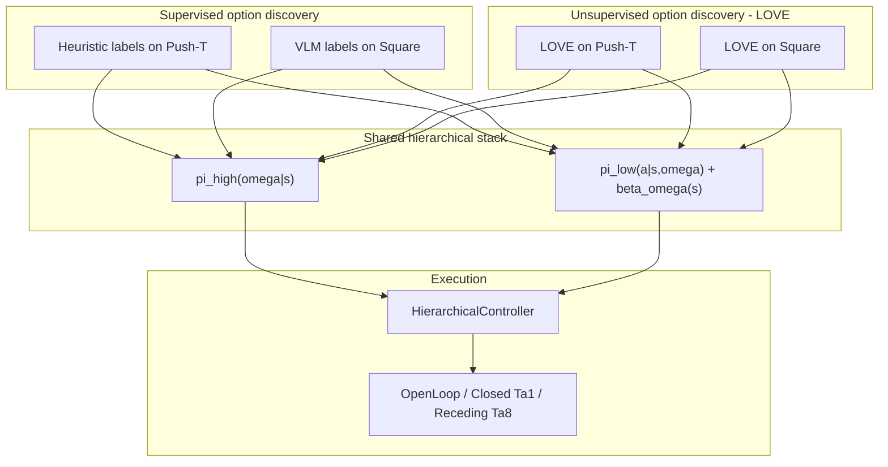

# SODA — Technical Project Plan

Living document for implementation. Derived from [`project_proposal.md`](project_proposal.md).

**Status:** Repo layout **scaffolded** (§3); implementation stubs empty.  
**Branch:** `dev_umar`

---

## How to read this document

| Part | Sections | Use when you need… |
|------|----------|-------------------|
| **I — Overview** | [§1 Goal](#1-goal) · [§2 Architecture](#2-architecture) | What SODA is and how the pieces fit |
| **II — Repository & code** | [§3 Layout](#3-repository-layout) · [§4 Code map](#4-code-map) · [§5 Data](#5-data) | Where files go and what they do |
| **III — Experiments & execution** | [§6 Evaluation](#6-evaluation) · [§7 Runbook](#7-execution-runbook) | Metrics, baselines, and **what to do next** |
| **IV — Project admin** | [§8 Open decisions](#8-open-design-decisions) · [§9–11](#9-team) · [Changelog](#changelog) | TBDs, ownership, git |

**Start implementing → [§7 Execution runbook](#7-execution-runbook)** (rows 1–32).

---

# Part I — Overview

## 1. Goal

Build a hierarchical imitation-learning policy where a high-level controller selects **options** and a low-level **diffusion policy** generates **variable-horizon** action chunks until a learned **termination** signal fires.

Option discovery is studied in a **2×2 matrix**: **supervised** vs **unsupervised (LOVE)** × **Push-T** vs **Square**—four training regimes sharing the same hierarchical stack. **Supervised labels are task-specific:** Push-T uses **heuristic** labels (notebook + zarr in git; optional regen via notebook); Square uses **VLM** (same pattern, later).

Compare against vanilla Diffusion Policy under open-loop, closed-loop (`T_a=1`), and receding-horizon (`T_a=8`) control, with **matched regimes** (DP open ↔ SODA open, etc.). **Push-T** is scored by **max block–target overlap (%)** over a fixed step budget; **Square** uses the standard DP success metric.

---

## 2. Architecture

### System diagram



### Experiments (2×2 + P0)

Same stack (`pi_high` + `pi_low` + termination); only **how options are labeled** changes.

| | **Push-T** | **Square** |
|--|------------|------------|
| **Supervised** | Heuristic (Colab) | VLM (Colab) |
| **Unsupervised (LOVE)** | LOVE → zarr `option_id` | LOVE → zarr `option_id` |

**Comparisons we care about:** supervision type (supervised vs LOVE); task (Push-T vs Square); vs frozen vanilla DP per regime.

| ID | Discovery | Task | Owner | Status | Runbook |
|----|-----------|------|-------|--------|---------|
| **P0** | Eval gate (E1 vs frozen DP) | Push-T | Umar | Not started | §7 rows 23–25 |
| **E1** | Heuristic supervised | Push-T | Umar | Zarr **complete** | §7 rows 2–25 |
| **E2** | VLM supervised | Square | Neetish (labels), Umar (train) | Not started | §7 rows 26, 28–29 |
| **E3** | LOVE unsupervised | Push-T | Neetish | Not started | §7 rows 27, 30 |
| **E4** | LOVE unsupervised | Square | Neetish | Not started | §7 rows 27, 31 |

### Component design (locked)

**Execution loop**

1. `pi_high` selects option `ω` given state `s`.
2. `pi_low` runs until `beta_omega(s) > beta_transition`.
3. Repeat.

**`pi_high` (high-level)**

- Discrete `pi_high(omega | s)` on segmented demos.
- **Training:** **flow matching** only (not BC/CE) — see [§8B](#b-high-level-flow-matching) for open FM details.
- Code: `soda/models/high_policy.py`, `soda/training/train_high.py` (pair: `train_low.py`).

**`pi_low` (low-level)**

- Backbone: [Diffusion Policy](https://github.com/real-stanford/diffusion_policy) 1D U-Net; extend via **subclasses in `soda/`** only ([§4.1](#41-third-party-dependencies)).
- **Temporal stretching:** variable segment length → train at `h_max`; predict **D+1** actions (horizon channel).
- **Horizon decode (locked):** `h_pred = mean(actions[..., -1])` → `TemporalStretcher.unstretch` ([§4.2](#42-soda-package-code-map)).
- **Termination:** `beta = MLP(stop_grad(bottleneck))`; BCE; no grad from β into U-Net ([§8](#8-open-design-decisions)).
- **Option conditioning (locked):** integer `option_id` → `nn.Embedding` → **concat** to global cond (not raw integer).
- **Loss:** `L_total = L_diffusion + L_termination` (no λ for shared-encoder balancing).
- Code: `soda/models/low_policy.py`, `soda/training/train_low.py` (pair: `train_high.py`).

---

# Part II — Repository & code

## 3. Repository layout

> **Not created yet.** Full target tree (every planned file). Role of each path → [§4](#4-code-map).

```
SODA-policy/
├── project_proposal.md
├── project_plan.md
├── README.md
├── environment.yml
├── .gitignore
│
├── third_party/                          # §4.1 — git submodules (pinned commits)
│   ├── diffusion_policy/                 #   upstream DP: baselines, envs, checkpoints
│   └── love/                             #   upstream LOVE: reference for E3/E4
│
├── soda/
│   ├── README.md                         #   package overview → project_plan §3
│   ├── dataset/                          #   PyTorch loaders (NOT zarr files — see root data/)
│   │   ├── temporal_stretch.py           #   TemporalStretcher.stretch / .unstretch
│   │   └── option_aware_dataset.py       #   OptionLabeledZarrDataset, derive_beta_labels
│   ├── models/
│   │   ├── low_policy.py                 #   LowPolicy (subclasses DP DiffusionUnetImagePolicy)
│   │   ├── high_policy.py                #   HighPolicy (flow matching π_high)
│   │   └── termination_head.py           #   TerminationHead
│   ├── training/
│   │   ├── losses.py                     #   L_diffusion + L_termination
│   │   ├── train_low.py                  #   π_low + termination (DP-style workspace loop)
│   │   └── train_high.py                 #   π_high flow matching
│   ├── inference/
│   │   ├── hierarchical_controller.py    #   HierarchicalController
│   │   └── control_regimes.py            #   open / closed Ta=1 / receding Ta=8
│   ├── eval/
│   │   ├── metrics.py                    #   Push-T overlap %; Square success
│   │   └── run_eval.py
│   └── option_discovery/
│       └── love_adapter/                 #   LOVE → zarr option_id (E3/E4)
│
├── configs/
│   ├── README.md                         #   supervised vs unsupervised naming
│   ├── pusht/
│   │   ├── soda_supervised.yaml          #   E1 (heuristic option_id)
│   │   ├── soda_unsupervised.yaml        #   E3 (LOVE option_id)
│   │   └── baseline_vanilla.yaml         #   frozen DP baseline
│   └── square/
│       ├── soda_supervised.yaml          #   E2 (VLM option_id)
│       ├── soda_unsupervised.yaml        #   E4 (LOVE option_id)
│       └── baseline_vanilla.yaml
│
├── scripts/
│   ├── README.md                         #   how to run train/eval scripts
│   ├── setup_submodules.sh
│   ├── download_data.sh                  #   Square only (Push-T zarr in git)
│   ├── train_soda.sh                     #   task=pusht|square discovery=supervised|unsupervised
│   └── eval_soda.sh
│
├── data/                                 # §5 — dataset FILES on disk (zarr, notebooks)
│   ├── README.md
│   ├── pusht/
│   │   └── pushT_labeling.ipynb          #   Colab regen: run all → upload zip
│   ├── square/
│   │   └── square_labeling.ipynb
│   ├── raw/
│   │   ├── pusht/
│   │   │   └── pusht.zarr/               #   ~19 MB, in git
│   │   │       ├── data/
│   │   │       │   ├── img/
│   │   │       │   ├── state/
│   │   │       │   ├── action/
│   │   │       │   └── option_id/
│   │   │       └── meta/
│   │   │           └── episode_ends
│   │   └── square/
│   │       └── square.zarr/              #   TBD: in git if small enough
│   └── processed/                        #   gitignored caches (e.g. beta_label)
│
└── experiments/                          #   outputs gitignored except README (see §5 git policy)
    └── README.md
```

### Folder READMEs (yes at top level, no in every subfolder)

Short `README.md` in **major** directories so newcomers know purpose + commands without opening `project_plan.md`. **Do not** add READMEs under `soda/models/`, `soda/dataset/`, `configs/pusht/`, etc.—that duplicates §3 and goes stale.

| README | Contents (keep brief) |
|--------|------------------------|
| `README.md` (repo root) | Project one-liner, setup, link to `project_plan.md` |
| `data/README.md` | Root `data/` vs `soda/dataset/`; zarr paths; git policy; Colab regen steps |
| `soda/README.md` | Package map (π_low / π_high / inference); pointer to §3 tree |
| `configs/README.md` | `soda_supervised` / `soda_unsupervised` × `pusht` / `square`; example Hydra command |
| `scripts/README.md` | `setup_submodules`, `train_soda.sh`, `eval_soda.sh` usage |
| `experiments/README.md` | Naming convention for runs; gitignored; where checkpoints/logs go |

**Skip:** `third_party/` (submodule docs live upstream), nested `soda/*/` READMEs.

---

## 4. Code map

[§3](#3-repository-layout) is the **visual file tree**; this section explains **what each part does** and how we hook into Diffusion Policy. Architecture rationale → [§2](#2-architecture).

### 4.1 Third-party dependencies

| Component | Strategy | Notes |
|-----------|----------|-------|
| [diffusion_policy](https://github.com/real-stanford/diffusion_policy) | Submodule `third_party/diffusion_policy` | Baselines, envs, frozen checkpoints |
| [love](https://github.com/yidingjiang/love) | Submodule `third_party/love` | Reference for E3/E4 |
| SODA features | Implement in `soda/` | **Subclass DP only**; fork only if bottleneck cannot be exposed |

**Locked:** git submodule + subclass; do not patch upstream for main experiments.

**Diffusion Policy hook points**

| Upstream (DP) | SODA extension |
|---------------|----------------|
| `model/diffusion/conditional_unet1d.py` | Expose bottleneck; action dim D+1 |
| `policy/diffusion_unet_image_policy.py` | `LowPolicy` (`low_policy.py`) |
| `dataset/pusht_image_dataset.py`, `square_*` | Extend/wrap in `soda/dataset/option_aware_dataset.py` |
| `workspace/train_diffusion_unet_image_workspace.py` | Pattern for `soda/training/train_low.py` |
| `env_runner/*_runner.py` | Hierarchical rollout wrapper |

### 4.2 `soda/` package

**Naming:** **SODA** = the full hierarchical system (repo + `soda/` package). Components use parallel names `LowPolicy` / `HighPolicy` (`low_policy.py` / `high_policy.py`)—no `soda_` prefix on individual modules (the package already provides that namespace).

**Two different “data” locations (not redundant):**

| Path | What it is |
|------|------------|
| **`data/`** (repo root) | **Files on disk** — zarr stores, labeling notebooks, caches |
| **`soda/dataset/`** | **Loader code** — PyTorch `Dataset` classes that read root `data/` |

#### `soda/dataset/` — loaders (extends Columbia Diffusion Policy)

We use the **same Zarr v2 layout** as [Diffusion Policy](https://github.com/real-stanford/diffusion_policy) (`data/img`, `state`, `action`, `meta/episode_ends`) so frozen DP checkpoints and env runners stay compatible. SODA adds **`data/option_id`** and training-time logic DP does not have.

| Reuse from DP (`third_party/diffusion_policy/dataset/`) | SODA-specific (in `soda/dataset/`) |
|--------------------------------------------------------|-----------------------------------|
| Zarr reading, episode indexing, image obs normalization patterns (`pusht_image_dataset.py`, `square_*`) | Read `option_id`; segment demos by option boundaries |
| Sequence sampling / windowing ideas | `TemporalStretcher` — variable-horizon stretch to `h_max` |
| — | `derive_beta_labels` from `option_id` transitions for termination BCE |

**Implementation approach:** subclass or wrap DP’s image dataset where possible; only fork logic that must change (option segments, stretch, β labels). Do not duplicate the whole loader if upstream helpers suffice.

| Path (see §3 tree) | Key symbols | Role |
|------|-------------|------|
| `dataset/temporal_stretch.py` | `TemporalStretcher.stretch`, `.unstretch` | Resample segments; mean-pool horizon decode |
| `dataset/option_aware_dataset.py` | `OptionLabeledZarrDataset`, `derive_beta_labels` | Load root `data/raw/.../*.zarr`; DP-compatible + SODA fields |
| `models/low_policy.py` | `LowPolicy` | Subclasses DP `DiffusionUnetImagePolicy`; embed(ω) + D+1 + β hook |
| `models/high_policy.py` | `HighPolicy` | Flow-matching `pi_high` |
| `models/termination_head.py` | `TerminationHead` | `MLP(stop_grad(bottleneck))` |
| `training/losses.py` | — | `L_diffusion + L_termination` |
| `training/train_low.py` | — | π_low + termination training loop (extends DP workspace pattern) |
| `training/train_high.py` | `flow_matching_option_loss` | π_high flow matching |
| `inference/hierarchical_controller.py` | `HierarchicalController` | Option loop + β threshold |
| `inference/control_regimes.py` | `run_control_regime` | Open / Ta=1 / Ta=8 |
| `eval/metrics.py` | `EvalMetrics` | Push-T overlap %; Square success |
| `eval/run_eval.py` | — | Rollout + logging |
| `option_discovery/love_adapter/` | — | LOVE → zarr `option_id` (E3/E4) |

### 4.3 `configs/` and `scripts/`

**Config naming (supervision axis):** both tasks use the same two filenames; the **task folder** sets data paths and label source:

| Config | Push-T (`configs/pusht/`) | Square (`configs/square/`) |
|--------|---------------------------|----------------------------|
| `soda_supervised.yaml` | E1 — heuristic `option_id` | E2 — VLM `option_id` |
| `soda_unsupervised.yaml` | E3 — LOVE `option_id` | E4 — LOVE `option_id` |
| `baseline_vanilla.yaml` | Frozen DP baseline | Frozen DP baseline |

Example: `python soda/training/train_low.py --config-path configs/pusht --config-name soda_supervised`

| Path (see §3 tree) | Role |
|------|------|
| `configs/{pusht,square}/soda_supervised.yaml` | Supervised option discovery |
| `configs/{pusht,square}/soda_unsupervised.yaml` | Unsupervised (LOVE → `option_id`) |
| `configs/{pusht,square}/baseline_vanilla.yaml` | Frozen DP baseline |
| `scripts/setup_submodules.sh` | Init submodules |
| `scripts/download_data.sh` | Square data only (Push-T = committed zarr) |
| `scripts/train_soda.sh` | `task=pusht\|square` + `discovery=supervised\|unsupervised` |
| `scripts/eval_soda.sh` | Eval driver |

**Doc hygiene:** when a design choice is locked, document it in [§2](#2-architecture) and implement under [§4](#4-code-map); remove from [§8](#8-open-design-decisions).

---

## 5. Data (files on disk)

> **Not** `soda/dataset/` (that is loader **code** — see [§4.2](#soda-dataset--loaders-extends-columbia-diffusion-policy)). This section is only **where zarr and notebooks live** under repo-root `data/`.

No JSON label files. Training data = **DP-format Zarr v2** + per-frame `data/option_id` (extra array vs vanilla DP).

**Source-of-truth model (Push-T; same pattern for Square later):**

- **Committed in git:** labeled zarr **and** the labeling notebook. After clone, use `data/raw/pusht/pusht.zarr/` directly—no Colab or external download required for training.
- **Regeneration (optional):** open `data/pusht/pushT_labeling.ipynb` in Colab, run all cells (notebook handles download, labeling, and export), then place the output zip into the repo and commit.

### Push-T (E1)

| Artifact | Path | In git |
|----------|------|--------|
| Labeling notebook | `data/pusht/pushT_labeling.ipynb` | Yes |
| Labeled dataset | `data/raw/pusht/pusht.zarr/` | Yes (~19 MB) |

**Regeneration workflow** (only when labels or export logic change)

1. Open `data/pusht/pushT_labeling.ipynb` in **Colab** and **Run all** — the notebook does everything (raw data, heuristic labels, zarr export, zip download).
2. Take the **zipped output** from Colab and upload it to `data/raw/pusht/` in this repo.
3. Unzip so the dataset lives at `data/raw/pusht/pusht.zarr/`, then commit the updated zarr (and notebook if you changed it).

**Zarr schema**

```
data/raw/pusht/pusht.zarr/
  data/img, state, action, option_id
  meta/episode_ends
```

Example: `T=25650`, `206` episodes. Requires `zarr<3.0`.

**At training time**

- Config points to `data/raw/pusht/pusht.zarr/` (this section).
- `soda/dataset/option_aware_dataset.py` opens that path and yields batches (extends DP dataset behavior; see §4.2).
- `beta_label` derived from `option_id` change points (optional cache in `data/processed/pusht/`).

### Square (E2) — later

Same pattern: Colab notebook in git + labeled zarr in git; regen = run Colab → upload output zip → `data/raw/square/square.zarr/` (size TBD for whether zarr stays in git).

### LOVE (E3/E4)

Export cluster IDs into `option_id` in the same zarr layout via `soda/option_discovery/love_adapter/`.

### Git policy

| Path | In git? | Notes |
|------|---------|-------|
| `data/pusht/pushT_labeling.ipynb` | Yes | Regeneration recipe |
| `data/raw/pusht/pusht.zarr/` | Yes (~19 MB) | Default training input |
| `data/square/square_labeling.ipynb` | Yes (when added) | Regeneration recipe |
| `data/raw/square/square.zarr/` | TBD | Commit if size allows |
| `data/README.md`, `soda/README.md`, `configs/README.md`, `scripts/README.md`, `experiments/README.md` | Yes | Short; see §3 Folder READMEs |
| `data/processed/`, `experiments/*` | No | Checkpoints and logs |
| `experiments/README.md` | Yes | Allowed via `.gitignore` exception |

---

# Part III — Experiments & execution

## 6. Evaluation

### P0 — first gate (Push-T)

| Arm | Training | Notes |
|-----|----------|-------|
| **Baseline** | Frozen official DP Push-T weights | No retraining |
| **Challenger** | SODA E1 from scratch | Heuristic zarr + full stack |

Eval under DP protocol (300 steps, max overlap). **Matched regimes only** (see below).

### Full method list

1. Vanilla Diffusion Policy (frozen checkpoints)
2. SODA E1 (Push-T, heuristic)
3. SODA E2 (Square, VLM)
4. SODA E3 (Push-T, LOVE)
5. SODA E4 (Square, LOVE)

### Control regimes (matched comparison)

| Regime | DP vs SODA |
|--------|------------|
| Open-loop | open ↔ open |
| Closed-loop (`T_a=1`) | closed ↔ closed |
| Receding (`T_a=8`) | receding ↔ receding |

Do not cross-pair regimes (e.g. DP receding vs SODA open-loop).

### Scope prioritization (TBD)

Full grid `{methods} × {tasks} × {regimes} × {stress}` is too large. Decide minimal set after P0. See [§8G](#g-stochasticity--stress-evaluation-push-t).

### Metrics

**Push-T:** max **overlap %** (headline); success rate (reference: ~100% coverage, ~91% best ckpt success); optional TTC.

**Square:** success rate; optional TTC.

### Push-T saturation / stress tests (initial)

Vanilla DP already scores very high at 300 steps. Consider later: test-time noise, shorter eval horizon, reduced SODA training budget. Not required for P0.

### Training fairness

- **P0:** frozen DP vs SODA from scratch (epoch budget TBD).
- Allow LR/WD retuning for SODA; document which DP checkpoint is used.

---

## 7. Execution runbook

Work top to bottom. Experiment IDs: [§2 Experiments](#experiments-22--p0).

#### A. Setup and data (Push-T / E1)

| # | Task | Ref | Assigned | Status |
|---|------|-----|----------|--------|
| 1 | Approve plan + [§3 layout](#3-repository-layout) | — | Umar | ☑ |
| 2 | Move labeled zarr → `data/raw/pusht/pusht.zarr/` | Step 1 | Umar | ☑ |
| 3 | Commit `data/README.md`, zarr, `environment.yml` (`zarr<3`); notebook via Drive script after first commit | §5 | Umar | ☐ |
| 4 | Scaffold `soda/`, configs, scripts, folder READMEs, `.gitignore` (§3) | Step 0 | Umar | ☑ |
| 5 | `environment.yml` + DP conda setup | Step 0 | Umar | ☐ |
| 6 | Push-T zarr on disk at `data/raw/pusht/pusht.zarr/` (train-ready; git add with commit) | §5 | Umar | ☑ |
| 7 | `derive_beta_labels` from `option_id` in dataset | Step 3 | Umar | ☐ |

#### B. Baseline (frozen DP)

| # | Task | Ref | Assigned | Status |
|---|------|-----|----------|--------|
| 8 | Add + init `third_party` submodules (`diffusion_policy`, `love`); pin commits — see `scripts/setup_submodules.sh` | §4.1 | Umar | ☑ |
| 9 | Load frozen Push-T checkpoint; smoke eval | Step 4, §6 | Umar | ☐ |
| 10 | Baseline metrics per regime (open / closed / receding) | §6 | Umar | ☐ |

#### C. SODA core code

| # | Task | Ref | Assigned | Status |
|---|------|-----|----------|--------|
| 11 | `temporal_stretch.py` | §4.2 | Umar | ☐ |
| 12 | `option_aware_dataset.py` | §4.2 | Umar | ☐ |
| 13 | `low_policy.py` | §2, §4.2 | Umar | ☐ |
| 14 | `termination_head.py` | §2, §4.2 | Umar | ☐ |
| 15 | `losses.py` + `train_low.py` | §4.2 | Umar | ☐ |
| 16 | `high_policy.py` + `train_high.py` | §2, §4.2 | Umar | ☐ |
| 17 | `hierarchical_controller.py` + `control_regimes.py` | §4.2 | Umar | ☐ |
| 18 | `metrics.py` + `run_eval.py` | §6 | Umar | ☐ |
| 19 | `configs/pusht/soda_supervised.yaml`, `baseline_vanilla.yaml` | §4.3 | Umar | ☐ |

#### D. Train E1 (Push-T)

| # | Task | Ref | Assigned | Status |
|---|------|-----|----------|--------|
| 20 | Train `pi_low` | Step 8, E1 | Umar | ☐ |
| 21 | Train `pi_high` (flow matching) | Step 9, E1 | Umar | ☐ |
| 22 | Sanity hierarchical rollout (one regime) | §6 | Umar | ☐ |

#### E. P0 eval gate

| # | Task | Ref | Assigned | Status |
|---|------|-----|----------|--------|
| 23 | Eval frozen DP vs SODA E1 (matched regimes) | P0, §6 | Umar | ☐ |
| 24 | Log results; note saturation vs DP refs | §6 | Umar | ☐ |
| 25 | Decide stress tests + regime priority | §8G, §6 | Umar | ☐ |

**P0 exit:** end-to-end train + eval works; at least one fair regime documented.

#### F. After P0

| # | Task | Ref | Assigned | Status |
|---|------|-----|----------|--------|
| 26 | `square_labeling.ipynb` + `data/raw/square/square.zarr` (VLM labels) | E2 | Neetish | ☐ |
| 27 | LOVE adapter → zarr (E3/E4) | §4.2 | Neetish | ☐ |
| 28 | Frozen DP Square baseline | E2 | Umar | ☐ |
| 29 | Train/eval E2 (Square, VLM supervised) | E2 | Umar | ☐ |
| 30 | Train/eval E3 (Push-T, LOVE) | E3 | Neetish | ☐ |
| 31 | Train/eval E4 (Square, LOVE) | E4 | Neetish | ☐ |
| 32 | Cross-matrix comparison write-up | Step 14 | Both | ☐ |

---

# Part IV — Project admin

## 8. Open design decisions

**Locked** (see [§2](#2-architecture), [§4](#4-code-map)):

| Topic | Decision |
|-------|----------|
| DP integration | Submodule + subclass in `soda/` |
| `pi_high` | Flow matching (not BC) |
| Horizon decode | Mean-pool horizon channel |
| Termination grads | `stop_grad(bottleneck)` for β |
| Option conditioning | `Embedding(ω)` → concat global cond |

### B. High-level flow matching (open)

| Choice | Options |
|--------|---------|
| Target space | Discrete ω vs continuous embed + round |
| Conditioning | `s` only vs `s` + low-level context |
| Sampling | FM steps vs few-step solver |

### E. Termination at inference (open)

Fixed `beta_transition` + val sweep (recommended) vs calibrated threshold.

### F. LOVE integration (open)

Image encoder adapter in `love_adapter` (recommended) vs low-dim LOVE vs boundaries-only.

### G. Stochasticity / stress evaluation (Push-T)

Run P0 on standard protocol first; then noise / shorter horizon / epoch budget (TBD).

---

## 9. Team

| Person | Scope |
|--------|-------|
| **Umar Padela** | E1, E2 train/eval + Square DP baseline (§7 A–E, 28–29), P0, `soda/` core |
| **Neetish Sharma** | E2 VLM labels (row 26), LOVE E3/E4 (rows 27, 30–31) |

---

## 10. Open questions

- [ ] Unique Push-T `option_id` values / `num_options`
- [ ] `square_labeling.ipynb` pipeline
- [ ] Frozen Push-T DP checkpoint for P0
- [ ] Push-T stress-test protocol
- [ ] Experiment priority list (methods × task × regime)
- [ ] GPU budget → SODA training length
- [ ] `beta_transition` sweep range
- [ ] FM parameterization details
- [ ] Submodule commit pins

---

## 11. Git workflow

- Branch: **`dev_umar`**
- **Commit:** Push-T zarr (~19 MB), labeling notebooks, code/configs
- **Do not commit:** `experiments/`, checkpoints, large Square zarr (until sized)

---

## Changelog

| Date | Change |
|------|--------|
| 2026-05-17 | Initial `project_plan.md` |
| 2026-05-17 | Push-T eval: max overlap %; 2×2 matrix; heuristic/VLM; P0; flow matching; stop_grad; mean-pool; Colab→zarr; pusht.zarr in git |
| 2026-05-17 | **Reorganized** into Parts I–IV; merged repo layout + code map (§3–§4); single runbook (§7) |
| 2026-05-17 | §5: git = canonical zarr + notebook; regen = Colab run-all → upload zip to `data/raw/...` |
| 2026-05-17 | §3: expanded tree with all §4 files + zarr layout; §4 = roles only |
| 2026-05-17 | Rename `soda_low_image_policy` → `soda_low_policy` (image-only tasks; no low-dim path) |
| 2026-05-17 | Naming: `low_policy` / `high_policy` (no `soda_` prefix; SODA = whole system under `soda/`) |
| 2026-05-17 | Rename `soda/data/` → `soda/dataset/`; clarify root `data/` = files, `soda/dataset/` = loaders; DP reuse table |
| 2026-05-17 | Rename `train_low_workspace.py` → `train_low.py` (symmetric with `train_high.py`) |
| 2026-05-17 | Configs: `soda_supervised.yaml` / `soda_unsupervised.yaml` per task (pusht + square) |
| 2026-05-17 | Folder README policy: major dirs only (not every `soda/` subfolder) |
| 2026-05-17 | §7 runbook: **Assigned** column (Umar / Neetish / Both); split rows 29–31 |
| 2026-05-17 | E3 train/eval assigned to Neetish (LOVE end-to-end) |
| 2026-05-17 | E2: Neetish labels (row 26); Umar train/eval + Square baseline (rows 28–29) |
